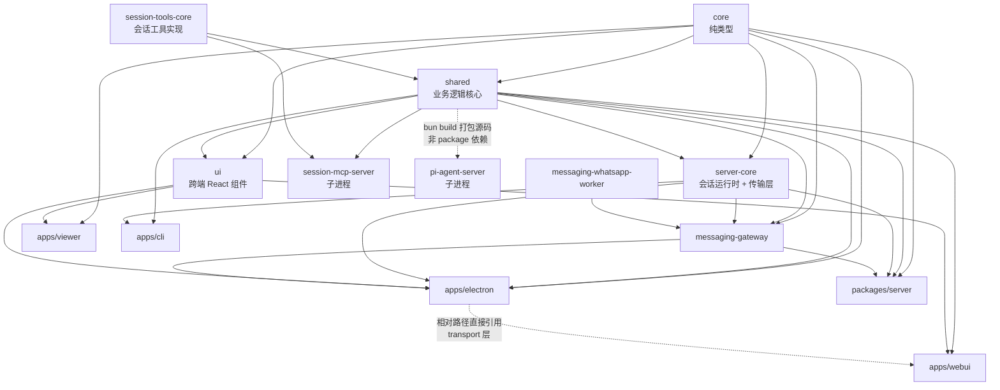

# 02 · 仓库地图

> 基于上游 craft-agents-oss v0.11.4 · 核验于 2026-08-08

Bun workspace 单仓，14 个包：`apps/*` 4 个（可运行的端），`packages/*` 10 个（库与子进程服务）。全部版本号锁在 `0.11.4`，跟随上游。

本篇是**查表用**的，不必通读。先看依赖方向一节建立方位感，剩下的按需回来查。

## 依赖方向

三条需要留意的边：

1. **`core` 与 `session-tools-core` 没有任何内部依赖** —— 它们是叶子。往这两个包里加东西时，如果发现需要 import 别的内部包，说明放错地方了。
2. **`apps/webui` 用相对路径直接 import `apps/electron/src/transport/`**（见 `apps/webui/src/adapter/web-api.ts`）。这不是包依赖，是源码级复用。改 transport 层要同时想到 webui。
3. **`pi-agent-server` 在 `package.json` 里没有任何内部依赖**，但它用相对路径直接 import `packages/shared/src/**` 的源文件，由 `bun build` 打包成单文件。改 shared 里被它引用的模块，需要重新 `bun run server:build:subprocess`。

## `apps/` —— 可运行的端

### `apps/electron` — 桌面应用主体

三进程 + 一个传输层，是仓库里最大的 app。

| 目录 | 职责 |
|---|---|
| `src/main/` | Electron 主进程。窗口管理、菜单、深链、自动更新、网络代理、通知、电源管理、浏览器面板（CDP）。**RPC handler 在 `main/handlers/`**，只有 GUI 相关的那部分（browser / settings / system / workspace），业务 handler 在 server-core |
| `src/preload/` | `bootstrap.ts` 构造 `RoutedClient` 并用 `buildClientApi()` 生成 `window.electronAPI`。**不手写方法**，全部由 `CHANNEL_MAP` 驱动 |
| `src/renderer/` | React 18 UI。`pages/`、`components/`、`atoms/`（jotai）、`hooks/`、`event-processor/`（Agent 事件流处理）、`playground/`（组件预览页） |
| `src/transport/` | WS RPC 客户端侧：`channel-map.ts`（方法名→信道）、`routed-client.ts`（本地/远程路由）、`build-api.ts`（API 代理生成） |
| `src/shared/` | 主进程与渲染进程共享：`types.ts`（`ElectronAPI` 接口，编译期契约）、`routes.ts`、`menu-schema.ts`、`settings-registry.ts`、`feature-flags.ts` |
| `src/runtime/` | 平台服务抽象：`platform.ts`（Electron 实现）、`platform-headless.ts`（无 GUI 实现） |
| `resources/` | 图标、Python 文档处理脚本（`resources/scripts/`）、下载的 `uv` 二进制 |

详见 [05-architecture](05-architecture.md) 与 [06-rpc](06-rpc.md)。

### `apps/webui` — 浏览器端 UI

复用渲染进程的全部 React 代码，只替换传输层与 LOCAL_ONLY 能力。

- `src/adapter/web-api.ts` —— 核心。复用 `WsRpcClient` + `buildClientApi` + `CHANNEL_MAP`，然后逐个覆盖 LOCAL_ONLY 方法的浏览器等价实现（文件选择用 `<input type=file>`、`openUrl` 用 `window.open`、原生文件夹对话框直接 no-op……）
- `src/shims/` —— 把 `electron-log`、`fs/promises`、`ws`、`@sentry/electron`、`open` 等 Node/Electron 专有模块替换成浏览器可用的空壳
- 认证走浏览器会话 Cookie（由服务端 `/api/auth` 下发），WebSocket 升级时自动携带，不用 bearer token

> **新增 LOCAL_ONLY 信道时**，如果 webui 也需要这个能力，必须在 `web-api.ts` 里补一个实现，否则 webui 会静默缺功能。

### `apps/viewer` — 只读分享页

单独的轻量前端，只依赖 `core` + `ui`。渲染已分享的会话快照，没有 RPC、没有编辑能力。改 `packages/ui` 的组件时它会跟着编译，所以共享组件不能依赖 Electron API。

### `apps/cli` — 命令行客户端

`client.ts` 连 WS RPC，`server-spawner.ts` 可以自己拉起一个 headless server。用法见 [docs/cli.md](../cli.md)。

## `packages/` —— 库

### `packages/core` — 纯类型与最小工具

无内部依赖。`types/`（`message.ts`、`session.ts`、`workspace.ts`、`server.ts`）+ `utils/`。

**`AgentEvent` 联合类型定义在 `core/src/types/message.ts`** —— 这是整个 Agent 事件流的契约，两个后端都要归一到它。

### `packages/shared` — 业务逻辑核心

仓库里最重的包，几乎所有业务概念都在这里。有 40+ 个 subpath export（见 `package.json` 的 `exports`），**跨包 import 一律走 subpath**，如 `@craft-agent/shared/agent`、`@craft-agent/shared/protocol`。

| 子目录 | 职责 |
|---|---|
| `agent/` | Agent 核心。`base-agent.ts`、`claude-agent.ts`、`pi-agent.ts`、`backend/`（后端抽象与工厂）、`core/`（权限、提示词构建、会话生命周期、用量统计） |
| `protocol/` | **RPC 协议契约**。`channels.ts`（信道常量）、`routing.ts`（信道分类）、`dto.ts`、`events.ts`、`types.ts` |
| `config/` | 配置存储、模型注册表（`models.ts` / `models-pi.ts`）、LLM 连接、偏好、主题、路径、文件监听 |
| `sources/` | Source 的存储、类型、凭据管理、token 刷新、MCP server 构建 |
| `sessions/` | 会话持久化（JSONL）、索引、bundle、slug 生成 |
| `credentials/` | 加密凭据存储（落盘为 `credentials.enc`） |
| `auth/` | 各家 OAuth 流程：Claude、ChatGPT、Google、Microsoft、Slack、通用 OAuth，含本地回调服务器与 PKCE |
| `mcp/` | MCP 客户端与连接池、代理工具名生成 |
| `automations/` | 自动化规则引擎：事件总线、条件匹配、cron、重试调度、历史 |
| `tasks/` `labels/` `statuses/` `views/` `projects/` `workspaces/` `skills/` | 各自的类型 + 存储 + CRUD |
| `i18n/` | 7 个 locale（en / zh-Hans / de / es / hu / ja / pl），`registry.ts` 是唯一真源 |
| `prompts/` | 系统提示词生成 |
| `unified-network-interceptor.ts` | 网络拦截器，**只对 Pi 子进程生效**，见 [07-agent-core](07-agent-core.md) |

> `packages/shared/CLAUDE.md` 记录了这个包里最容易踩的坑，写代码前值得扫一遍。

### `packages/server-core` — 会话运行时 + 传输层

「服务端」的全部实现，与 Electron 无关，因此桌面端和 headless 服务端能共用。

| 子目录 | 职责 |
|---|---|
| `transport/` | `WsRpcServer`（WebSocket RPC 服务端）、`client.ts`（`WsRpcClient`）、`codec.ts`、`push.ts`、`capabilities.ts` |
| `bootstrap/` | **`headless-start.ts` 里的 `bootstrapServer()` 是整个应用的启动枢纽** —— Electron 主进程和独立服务端都调它 |
| `sessions/` | `SessionManager.ts`（9000 行，会话生命周期的核心）、运行时配置、远程浏览器面板代理 |
| `handlers/rpc/` | 业务 RPC handler，20+ 个模块按域拆分（sessions / tasks / sources / skills / labels / oauth / automations / messaging …） |
| `tasks/` | `TaskRunner.ts`、`create-task.ts`（任务创建的共享核心，RPC 与 Agent 工具都走它） |
| `services/` | 搜索（ripgrep）、图片处理、Git Bash 探测、特权执行代理 |
| `webui/` | 给 webui 提供的 HTTP 服务：静态资源托管、登录、Cookie 会话 |
| `runtime/` | 平台抽象接口与无 GUI 默认实现 |
| `domain/` | 无副作用的领域逻辑：连接配置推导、标题净化、初始化门控 |

### `packages/ui` — 跨端 React 组件

`chat/`、`markdown/`、`code-viewer/`、`terminal/`、`annotations/`、`overlay/`、`icons/`、`ui/`。

被 electron renderer、webui、viewer 三端共用，**因此不能依赖 Electron API 或 Node 内置模块**。组件该放这里还是放 `apps/electron/src/renderer/components/ui/`，见 `.claude/skills/ui-components`。

### `packages/server` — 独立 headless 服务端

薄封装。`src/index.ts` 解析环境变量、加载 TLS、然后调 `bootstrapServer()`。真正的逻辑都在 server-core。可 Docker 化（根目录 `Dockerfile.server`）。

### `packages/session-tools-core` — 会话工具的共享实现

无内部依赖，被 `shared` 和 `session-mcp-server` 共用，保证 Claude 侧与 Pi 侧的工具行为一致。

`handlers/` 下每个文件是一个工具：`create-task`、`submit-plan`、`set-session-status`、`set-session-labels`、`archive-session`、`list-sessions`、`source-test`、`source-oauth`、`transform-data`、`render-template`、`script-sandbox`、`mermaid-validate`、`skill-validate` 等。

### `packages/session-mcp-server` — 会话工具的 MCP 封装

把 `session-tools-core` 的工具包成一个 stdio MCP 服务器。需要通知主进程的工具（如 SubmitPlan 触发计划展示、OAuth 触发暂停）通过 **stderr 上带 `__CALLBACK__` 前缀的 JSON 行**回传。

> ⚠️ **它当前可能是死代码。** `electron:dev`、`server:build:subprocess`、`Dockerfile.server` 都会构建它，`runtime-resolver.ts` 也会解析出 `sessionServerPath`，但 **v0.11.4 的源码里找不到任何 spawn 它的调用点**。两个后端都不经过它：Claude 侧用 SDK 的进程内 `createSdkMcpServer()`（`claude-agent.ts`），Pi 侧用 `backend/pi/session-tool-defs.ts` 直接声明工具定义。它的文件头注释说是「供 Codex 使用」，推测是早期方案的遗留。
>
> 动它之前先确认是否真的没人用；不要因为「看起来没人用」就删 —— 打包脚本还指着它。

### `packages/pi-agent-server` — Pi Agent 运行时（子进程）

包裹 `@earendil-works/pi-coding-agent`，通过 **stdio 上的 JSONL 协议**与主进程通信。独立进程的原因是 Pi SDK 是 ESM + 重依赖，直接打进 Electron 主进程会有 bundling 问题。

除了转发对话，它还自带 `tools/web-fetch.ts` 和 `tools/search/`（ChatGPT / OpenAI / Google / DDG 四个搜索 provider）。

### `packages/messaging-gateway` / `packages/messaging-whatsapp-worker`

把 Agent 会话接到即时通讯软件。核心文件：`gateway.ts`、`router.ts`、`registry.ts`、`topic-registry.ts`、`pairing.ts`、`access-control.ts`、`event-fanout.ts`、`renderer.ts`。

`src/adapters/` 下**三个平台适配器**，都实现同一个 `PlatformAdapter` 接口：

| 适配器 | 运行方式 | 消息编辑 | 内联按钮 | 单条长度上限 | Markdown |
|---|---|---|---|---|---|
| `lark` | 进程内，`@larksuiteoapi/node-sdk` 的 WSClient 长轮询 | ✅ | ✅ | 30000 | `lark-post` |
| `telegram` | 进程内，grammY | ✅ | ✅ | — | `v2` |
| `whatsapp` | **独立 worker 子进程**（Baileys 依赖太重） | ❌ | ❌ | — | `whatsapp` |

三者 `webhookSupport` 都是 `false` —— 全部走长轮询/长连接，**不需要公网可达的回调地址**，这对桌面应用是正确的选择。

> **Lark 与飞书是两个独立生态**，共用同一套 SDK 与协议，但机器人只能注册在其中一个开放平台上。由配置里的 `domain` 字段区分：`'lark'` → `open.larksuite.com`（国际版），`'feishu'` → `open.feishu.cn`（中国版）。

## 边界红线

| 规则 | 违反的后果 |
|---|---|
| `core` / `session-tools-core` 不引入内部依赖 | 循环依赖，`pi-agent-server` 的 bun build 会炸 |
| `packages/ui` 不碰 Electron API 与 Node 内置模块 | webui / viewer 编译失败 |
| 跨包 import 走 subpath export，不写深路径 | 上游改目录结构时大面积失效 |
| 业务 RPC handler 放 `server-core/handlers/rpc/`，不放 `apps/electron/src/main/handlers/` | headless 服务端缺功能（它只注册 core handler） |
| 渲染进程专用组件放 `apps/electron/src/renderer/components/ui/`，三端共享的放 `packages/ui/src/components/` | 放错会导致编译失败或无法复用 |
| 改 `shared` 里被 `pi-agent-server` 引用的模块后，重新构建子进程 | 运行的是旧代码，症状诡异 |
