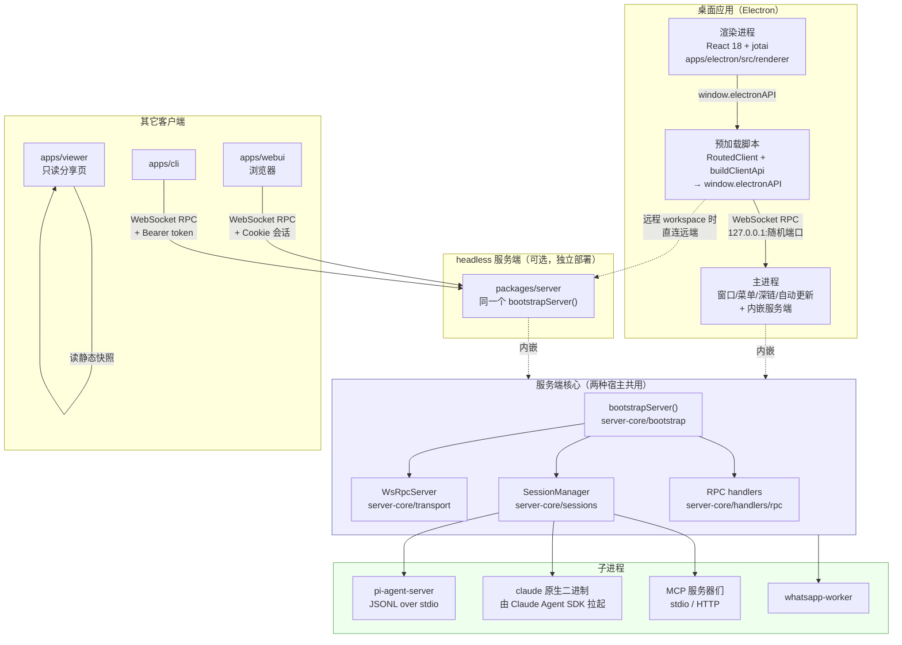
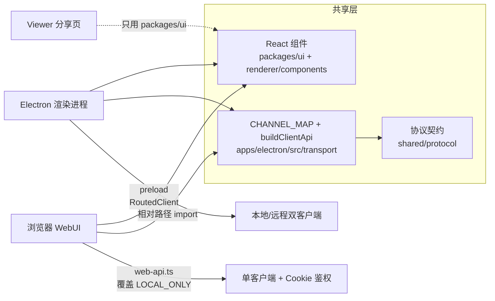

# 05 · 整体架构

> 基于上游 craft-agents-oss v0.11.4 · 核验于 2026-08-08

## 一句话概括

**这不是一个「Electron 应用」，而是一个「服务端 + 多个客户端」的系统，其中桌面应用只是把服务端嵌进了 Electron 主进程。**

理解了这一句，后面所有反直觉的设计都变得自然：为什么不用 `ipcRenderer.invoke`、为什么 session 管理代码在 `server-core` 而不在 `apps/electron`、为什么浏览器能跑同一套 UI。

## 图① 进程与包依赖总图



## 关键设计：一个 `bootstrapServer()`，两种宿主

整个应用的启动枢纽是 **`bootstrapServer()`**，定义在 `packages/server-core/src/bootstrap/headless-start.ts`。

它被两个地方调用，参数不同、逻辑相同：

| 调用方 | 场景 | 差异 |
|---|---|---|
| `apps/electron/src/main/index.ts` | 桌面应用 | 绑 `127.0.0.1` + 随机端口（除非开了 server mode）；注册全部 handler（core + GUI）；platform 是 Electron 实现 |
| `packages/server/src/index.ts` | headless 服务端 | 绑环境变量指定的 host/port，要求 bearer token；**只注册 core handler**；platform 是无 GUI 实现 |

`bootstrapServer()` 负责：获取单实例锁 → 初始化平台服务 → 创建 `SessionManager` → 启动 `WsRpcServer` → 注册 RPC handler → 装事件推送通道 → 初始化模型刷新服务。

**这是二次开发时最重要的一个入口。** 想加一个全局的启动期初始化，多半就在这里或它的回调参数里。

### 由此推出的一条硬规则

> **业务 RPC handler 必须放在 `packages/server-core/src/handlers/rpc/`，不要放在 `apps/electron/src/main/handlers/`。**

因为 headless 模式只注册 core handler。放错地方的直接后果是：桌面版好用，部署到服务器上功能凭空消失。

`apps/electron/src/main/handlers/` 里只应该有真正需要 Electron 的东西 —— 目前只有 `browser.ts`（浏览器面板）、`settings.ts`、`system.ts`、`workspace.ts` 四个。

## 三进程模型（Electron 侧）

### 主进程

除了标准的 Electron 职责（窗口、菜单、托盘、深链、自动更新、通知、电源管理），它还额外承担：

- **内嵌 WS RPC 服务端** —— 监听 `127.0.0.1` 随机端口；如果用户在设置里开了 Server Mode，改绑 `0.0.0.0` 并启用 token 鉴权，此时**别的桌面客户端**可以连过来用这台机器上的 workspace

  > ⚠️ **Server Mode 不提供 WebUI。** 它只暴露 WS RPC，**主进程完全没有引用 `server-core/webui/` 的任何代码**（可以 `grep -n "webui" apps/electron/src/main/index.ts` 自行确认，结果是空的）。
  >
  > 想让浏览器访问必须跑 `packages/server` —— 只有它会 `createWebuiHandler()` 并在同端口上提供 HTTP。详见 [12-build-deploy](12-build-deploy.md) 的 WebUI 部署一节。
- **Sentry 初始化** —— 在文件最顶部，早于其它 import，带凭据脱敏的 `beforeSend`
- **shell 环境加载** —— `loadShellEnv()` 是整个文件的第一行执行代码，把用户 shell 里的 PATH（Homebrew、nvm 等）读进来，否则 Agent 调用的命令行工具会找不到
- **主进程 i18n** —— 没有 localStorage，启动时从 `preferences.uiLanguage` 恢复语言

### 预加载脚本

`apps/electron/src/preload/bootstrap.ts`。做两件事：

1. 构造 `RoutedClient`（两个 WS 客户端：本地的 + 当前 workspace 所属服务器的）
2. 用 `buildClientApi(client, CHANNEL_MAP)` **动态生成** `window.electronAPI`

**这里没有一行手写的方法。** 加一个 API 方法不需要改 preload，只需要往 `CHANNEL_MAP` 里加一条。详见 [06-rpc](06-rpc.md)。

### 渲染进程

标准 React 18 + Vite。状态用 jotai（`renderer/atoms/`），路由是自研的类型安全方案（`shared/routes.ts` + `renderer/contexts/NavigationContext.tsx`），Agent 事件流由 `renderer/event-processor/` 消费。

组件分两处存放，放错会导致 webui/viewer 编译失败：

| 位置 | 用途 |
|---|---|
| `apps/electron/src/renderer/components/` | 渲染进程专用（含 shadcn 组件在 `components/ui/`） |
| `packages/ui/src/components/` | 三端共享，**不能依赖 Electron API 或 Node 内置模块** |

## 三端如何复用同一套逻辑

这是这个架构最大的收益，也是改动时最容易破坏的地方。



三端的差异只有两处：

1. **传输层入口不同** —— Electron 走 preload 的 `RoutedClient`（能同时连本地和远程），webui 走 `apps/webui/src/adapter/web-api.ts`（单个远程连接 + Cookie 鉴权）
2. **LOCAL_ONLY 能力不同** —— 浏览器没有原生文件对话框、没有窗口管理、不能 `shell.openPath`。`web-api.ts` 逐个覆盖了这些方法的浏览器等价实现（文件选择用 `<input type=file>`，文件夹选择直接返回 `null`，`openFile` / `showInFolder` 是 no-op）

webui 还需要 `apps/webui/src/shims/` 把 `electron-log`、`fs/promises`、`ws`、`@sentry/electron`、`open` 这些 Node/Electron 专有模块替换成浏览器空壳。

> **加新功能时的自检**：这个功能在浏览器里应该有吗？有 → 确保它走 REMOTE_ELIGIBLE 信道；有但需要本地能力 → LOCAL_ONLY + 在 `web-api.ts` 补 web 实现；没有 → LOCAL_ONLY 即可，webui 会自然缺失。

## 子进程

主进程会拉起这些子进程，它们都不是常驻的（除了 WhatsApp worker）：

| 子进程 | 什么时候起 | 通信方式 |
|---|---|---|
| **pi-agent-server** | 会话用 `pi` provider 时，每会话一个 | stdio 上的 JSONL 协议 |
| **claude 原生二进制** | 会话用 `anthropic` provider 时，由 Claude Agent SDK 自己 spawn | SDK 内部协议 |
| **MCP 服务器** | 会话启用了 stdio 类型的 source | MCP stdio 传输 |
| **messaging-whatsapp-worker** | 配了 WhatsApp 网关时 | 独立进程，Electron 内置 Node 运行 |

路径解析全部集中在 `packages/shared/src/agent/backend/internal/runtime-resolver.ts` —— 它要同时应付 monorepo 开发态、打包后的 `.app` 布局、以及 Docker 里的 headless 服务端，因此有大量 `resolveUpwards` 的向上查找。子进程「找不到」类的问题基本都能在这个文件里定位。

详见 [07-agent-core](07-agent-core.md)。

## 数据流：一次用户操作

以「用户点击发送消息」为例，走完整条链路：

```
渲染进程  用户点发送
   │  window.electronAPI.sendMessage(sessionId, text)
   ▼
preload   RoutedClient.invoke('sessions:sendMessage', ...)
   │  信道是 REMOTE_ELIGIBLE → 路由到 workspaceClient
   ▼
WebSocket ws://127.0.0.1:<port>（本地）或 wss://远端
   ▼
主进程    WsRpcServer 收到 → 派发给注册的 handler
   │  server-core/handlers/rpc/sessions.ts
   ▼
          SessionManager.sendMessage()
   │  选后端 → ClaudeAgent 或 PiAgent
   ▼
子进程    模型推理 + 工具调用
   │  原生事件
   ▼
          EventAdapter 归一成 AgentEvent
   ▼
          SessionManager 持久化到 JSONL + 通过 event sink 推送
   ▼
WebSocket 服务端 push（带 seq，断线可重放）
   ▼
渲染进程  event-processor 消费 → 更新 jotai atom → React 重渲染
```

每一段的细节：传输层见 [06-rpc](06-rpc.md)，Agent 段见 [07-agent-core](07-agent-core.md)。

## 二次开发时的常见落点

| 你想做的事 | 大概率要动的地方 |
|---|---|
| 加一个后端能力 | `server-core/handlers/rpc/` 新增或扩展 handler + 信道定义 + `CHANNEL_MAP` |
| 加一个页面 | `renderer/pages/` + `shared/routes.ts` |
| 改 Agent 行为 | `shared/src/agent/`，注意区分 Claude 侧与 Pi 侧 |
| 接新模型 | `shared/src/config/models-pi.ts` + LLM Connection，通常不需要动 backend |
| 加工具 | `session-tools-core/handlers/` （两个后端自动都有） |
| 改启动流程 | `server-core/bootstrap/headless-start.ts` 或 `apps/electron/src/main/index.ts` 传入的回调 |
| 私有化部署 | `packages/server` + `Dockerfile.server` |
