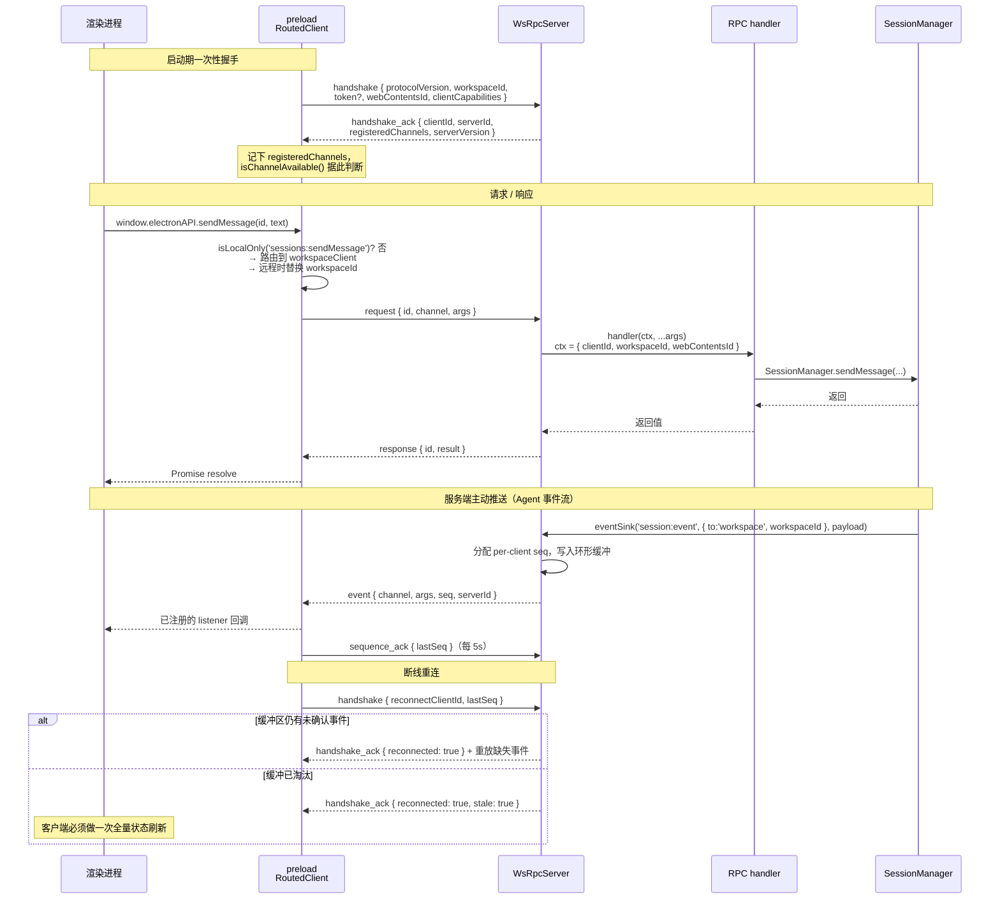

# 06 · 进程间通信（WS RPC）

> 基于上游 craft-agents-oss v0.11.4 · 核验于 2026-08-08

## 先纠正一个预期

**本项目不用 `ipcRenderer.invoke`。**

进程间通信走一层自建的 WebSocket RPC。代价是多了一层抽象，收益是同一套渲染层代码能跑在三个地方：Electron 里、浏览器里、以及连接远程服务器时。

如果你带着「Electron IPC」的心智来看这部分代码，会觉得处处别扭。换成「这是一个 WebSocket API，只不过服务端恰好在同一台机器上」就顺了。

## 分层

```
渲染进程   window.electronAPI.getSessions()
   │         ← 由 buildClientApi() 依据 CHANNEL_MAP 动态生成，不是手写的
   ▼
preload    RoutedClient
   │         ├── localClient      → 本地内嵌服务端（LOCAL_ONLY 信道）
   │         └── workspaceClient  → 当前 workspace 所属服务端（REMOTE_ELIGIBLE 信道，可能在远端）
   ▼
WebSocket  ws://127.0.0.1:<随机端口>  或  wss://<远程服务器>
   ▼
服务端     WsRpcServer → 按 channel 派发给注册的 handler
```

### 关键文件

| 文件 | 职责 |
|---|---|
| `packages/shared/src/protocol/channels.ts` | 信道名常量 `RPC_CHANNELS`。**值是 wire format，是稳定契约** |
| `packages/shared/src/protocol/routing.ts` | 信道分类：`LOCAL_ONLY_CHANNELS` / `REMOTE_ELIGIBLE_CHANNELS` 两个 Set |
| `packages/shared/src/protocol/types.ts` | 消息信封 `MessageEnvelope`、错误码、协议常量 |
| `packages/server-core/src/transport/server.ts` | `WsRpcServer` —— 连接生命周期、握手、心跳、鉴权、派发、推送 |
| `packages/server-core/src/transport/client.ts` | `WsRpcClient` —— 重连、事件重放、序号确认 |
| `apps/electron/src/transport/channel-map.ts` | `CHANNEL_MAP`：方法名 → 信道 |
| `apps/electron/src/transport/routed-client.ts` | `RoutedClient`：按分类路由到本地或远程 |
| `apps/electron/src/transport/build-api.ts` | `buildClientApi()`：由 `CHANNEL_MAP` 生成 API 代理 |
| `apps/electron/src/shared/types.ts` | `ElectronAPI` 接口 —— 运行时是代理，**类型全靠这个接口约束** |
| `packages/server-core/src/handlers/rpc/*.ts` | 业务 handler，按域拆分 |

## 图② 一次 RPC 调用的完整时序



### 可靠投递的几个数字

定义在 `protocol/types.ts`，改之前先想清楚影响：

| 常量 | 值 | 含义 |
|---|---|---|
| `PROTOCOL_VERSION` | `'1.0'` | 握手时校验，不匹配直接拒绝 |
| `HEARTBEAT_INTERVAL_MS` | 30s | 服务端 ping 间隔 |
| `HEARTBEAT_MAX_MISSED` | 2 | 连续漏掉这么多 pong 就断开 |
| `REQUEST_TIMEOUT_MS` | 30s | 请求默认超时 |
| `EVENT_BUFFER_MAX_SIZE` | 500 | 每客户端事件环形缓冲条数 |
| `EVENT_BUFFER_TTL_MS` | 30s | 事件在缓冲里的存活时间 |
| `DISCONNECTED_CLIENT_TTL_MS` | 60s | 断线客户端的缓冲保留时长 |
| `SEQUENCE_ACK_INTERVAL_MS` | 5s | 客户端确认序号的间隔 |

**长耗时的 RPC 要小心 30 秒超时。** 需要更久的操作应该设计成「立即返回 + 后续通过 event 推进度」，而不是加长超时。

## 信道分类：两个 Set，选错会出诡异 bug

每个信道必须归入且仅归入其中一个：

**`LOCAL_ONLY_CHANNELS`** —— 从根本上依赖本机 OS / Electron 的能力。窗口管理、原生文件/文件夹对话框、`shell` 打开、本地文件路径、workspace 列表（本地配置）。

**`REMOTE_ELIGIBLE_CHANNELS`** —— 属于 workspace 的数据，谁持有 workspace 就由谁处理。会话、消息、任务、工具调用、sources、skills —— 绝大多数业务方法。

判断口诀：

> 当这个 workspace 位于远程服务器上时，这个调用**还应该在本机执行吗**？
> 是 → `LOCAL_ONLY`　　否 → `REMOTE_ELIGIBLE`

分类错的典型后果：把一个本地文件路径相关的信道标成 `REMOTE_ELIGIBLE`，远程服务器收到本机路径却解析不了。仓库里 `file.READ_USER_ATTACHMENT` 的注释就记录了这个坑 —— 草稿里的附件路径是渲染进程用 `webUtils.getPathForFile` 拿到的本机路径，即便 workspace 在远端也必须本地读。

**漏分类会被测试拦住。** `packages/shared/src/protocol/__tests__/routing.test.ts` 做穷尽性校验：每个信道恰好归入一个 Set，两个 Set 里也不能有不存在的信道。

```bash
cd packages/shared && bun test src/protocol
```

## 新增一个 RPC 方法：必改 4 处

漏掉任何一处都会失败，且报错位置离病因很远。按顺序改。

### 1. 定义信道 — `packages/shared/src/protocol/channels.ts`

```ts
export const RPC_CHANNELS = {
  sessions: {
    GET: 'sessions:get',
    MY_NEW_METHOD: 'sessions:myNewMethod',   // ← 加这里
  },
}
```

命名遵循 `domain:camelCase`。**字符串值是对外契约，改动等于破坏兼容性**（老版本客户端连新版服务端会 `CHANNEL_NOT_FOUND`）；键名可以自由重组。

### 2. 分类信道 — `packages/shared/src/protocol/routing.ts`

按上一节的口诀放进两个 Set 之一。**加注释说明为什么** —— 这个文件里的注释是后人判断分类是否正确的唯一线索。

### 3. 映射方法名 — `apps/electron/src/transport/channel-map.ts`

```ts
export const CHANNEL_MAP = {
  myNewMethod: invoke(RPC_CHANNELS.sessions.MY_NEW_METHOD),        // 请求/响应
  onMyNewEvent: listener(RPC_CHANNELS.sessions.MY_NEW_EVENT),      // 服务端推送
}
```

- `invoke(channel, transform?)` —— 第二个参数可以对返回值做转换
- `listener(channel)` —— 生成的方法接收回调，返回取消订阅函数
- **键名带点会变成嵌套命名空间**：`'browserPane.create'` → `api.browserPane.create()`

渲染进程侧的 `window.electronAPI.myNewMethod()` 由此自动生成，**不需要手写 preload**。

### 4. 补类型 + 注册服务端 handler

**类型** —— `apps/electron/src/shared/types.ts` 的 `ElectronAPI` 接口里补方法签名。运行时是 Proxy，编译期的所有约束都来自这个接口，漏了就等于没有类型。

**handler** —— 放在 `packages/server-core/src/handlers/rpc/<域>.ts`：

```ts
export const HANDLED_CHANNELS = [
  RPC_CHANNELS.sessions.MY_NEW_METHOD,   // 该模块声明它处理哪些信道
] as const

export function registerSessionsHandlers(server: RpcServer, deps: HandlerDeps): void {
  server.handle(RPC_CHANNELS.sessions.MY_NEW_METHOD, async (ctx, arg1: string) => {
    // ctx: { clientId, workspaceId, webContentsId }
    // deps: { sessionManager, platform, windowManager?, browserPaneManager?, ... }
    return await doSomething(arg1)
  })
}
```

新建 handler 模块的话，还要在 `packages/server-core/src/handlers/rpc/index.ts` 的 `registerCoreRpcHandlers()` 里挂上。

> ⚠️ **只有真正需要 Electron 的 handler 才放 `apps/electron/src/main/handlers/`。** headless 服务端只注册 core handler，放错位置会导致「桌面版有、服务端版没有」。

### 第 5 处：webui 可能需要一个 web 等价实现

先澄清一个容易搞混的点：**webui 里没有 `RoutedClient`**。它用 `apps/webui/src/adapter/web-api.ts` 里的单个 `WsRpcClient` 直接 `buildClientApi()`，`isLocalOnly()` 根本不参与。所以在 webui 里，**所有信道都发往服务端**。

于是判断标准不是「这个信道是不是 LOCAL_ONLY」，而是：

> **headless 服务端注册了这个信道的 handler 吗？**

| 情况 | webui 的结果 |
|---|---|
| handler 在 `server-core/handlers/rpc/`（core handler） | ✅ 正常工作，即使信道被分类为 LOCAL_ONLY |
| handler 只在 `apps/electron/src/main/handlers/`（GUI handler） | ❌ 服务端没注册 → `CHANNEL_NOT_FOUND` |
| 能力在浏览器里根本不存在（原生对话框、窗口管理、`shell` 打开） | ❌ 必须在 `web-api.ts` 里覆盖成 web 等价实现 |

`web-api.ts` 覆盖的正是后两类：文件选择改用 `<input type=file>`，文件夹选择直接返回 `null`，`openFile` / `showInFolder` 是 no-op，`getRuntimeEnvironment()` 返回 `'web'`。

**新增信道时的自检**：handler 放在 core 里了吗？没有的话 webui 需要什么行为？

客户端可以用 `window.electronAPI.isChannelAvailable(channel)` 判断服务端有没有注册 —— 这个信息来自握手时服务端回的 `registeredChannels`。

## 服务端 → 客户端：推送与反向调用

`RpcServer` 接口（`packages/server-core/src/transport/types.ts`）除了 `handle` 还有：

```ts
push(channel: string, target: PushTarget, ...args: any[]): void
invokeClient(clientId: string, channel: string, ...args: any[]): Promise<any>
hasClientCapability(clientId: string, capability: string): boolean
findClientsWithCapability(capability: string, opts?: { workspaceId?: string }): string[]
```

**`push`** 的 target 三选一：

```ts
{ to: 'all', exclude?: clientId }
{ to: 'workspace', workspaceId, exclude?: clientId }
{ to: 'client', clientId }
```

**`invokeClient`** 是反向 RPC —— 服务端调用客户端注册的「能力」（`RpcClient.handleCapability`）。典型场景是浏览器面板：真正的浏览器窗口在桌面客户端上，远程服务器要操作它就得反向调过去。

> **不要绕过 event sink 直接 `webContents.send`。** `bun run lint:ipc-sends` 会检查这个 —— 直接发送绕过了序号分配和重连重放，远程客户端收不到。确属例外时在该行或上一行加 `raw-send-ok:<原因>` 注释。

## 错误处理

错误码是封闭集合（`protocol/types.ts` 的 `ErrorCode`）。抛错用 `CodedError`：

```ts
import { CodedError } from '@craft-agent/shared/protocol'
throw new CodedError('SESSION_NOT_IDLE', '会话正在处理中')
```

> **接收侧必须判 `err.code === 'X'`，绝不能用 `err instanceof CodedError`** —— 类身份过不了 wire，传输层在接收端重建的是带 `.code` 的普通 `Error`。

## 验证

```bash
cd packages/shared && bun test src/protocol      # 信道分类穷尽性
cd apps/electron   && bun test src/transport     # 路由行为
bun run typecheck:all
bun run lint:ipc-sends
```

操作细节的速查版见 `.claude/skills/electron-ipc`。
