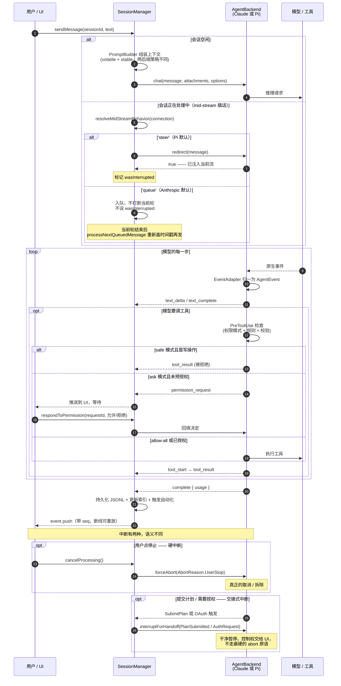

# 07 · Agent 内核与 pi Agent

> 基于上游 craft-agents-oss v0.11.4 · 核验于 2026-08-08

这是产品的核心，也是最容易踩坑的一层。核心事实只有一个：

> **这个应用同时跑着两套完全不同的 Agent 运行时**，上层用一个接口把它们抹平了。凡是「Claude 上好使、换个模型就不对」的问题，根因基本都在这里。

## 为什么是两个后端

| 后端 | provider | SDK | 跑在哪 |
|---|---|---|---|
| **ClaudeAgent** | `anthropic` | `@anthropic-ai/claude-agent-sdk` | SDK 自己 spawn 一个原生 `claude` 二进制 |
| **PiAgent** | `pi` | `@earendil-works/pi-coding-agent` + `pi-ai` | 我们自己 spawn 的 `pi-agent-server` 子进程 |

Claude 后端只服务 Anthropic。**其它所有模型供应商 —— OpenAI、Google AI Studio、GitHub Copilot、ChatGPT Plus、AWS Bedrock、任意 OpenAI 兼容端点 —— 全部走 Pi 后端。**

所以从我们的二次开发视角看：**Pi 才是主路径**。要接内部模型网关，几乎肯定是往 Pi 这条线上加，而不是仿写 `claude-agent.ts`。

## 契约：`AgentBackend`

定义在 `packages/shared/src/agent/backend/types.ts`。两个后端都实现它，上层（`SessionManager`）只认这个接口。

核心方法：

```ts
interface AgentBackend {
  // 对话主循环 —— 流式吐出统一的 AgentEvent
  chat(message, attachments?, options?): AsyncGenerator<AgentEvent>

  // 三种「停下来」，语义不同，不能混用（见下文）
  abort(reason?: string): Promise<void>
  forceAbort(reason: AbortReason): void
  interruptForHandoff(reason: AbortReason): void

  // 流式过程中插话。返回 true = 已注入当前流；false = 已中断，需上层排队重发
  redirect(message: string): boolean

  // 轻量补全，用于连接测试、生成标题、摘要
  runMiniCompletion(prompt: string): Promise<string | null>

  postInit(): Promise<PostInitResult>
  destroy(): void

  // 模型 / 思考等级 / 权限模式
  getModel() / setModel() / getThinkingLevel() / setThinkingLevel()
  getPermissionMode() / setPermissionMode() / cyclePermissionMode()

  // 不重建后端的前提下热更运行时配置；返回 false 表示改不了，上层需重启后端
  updateRuntimeConfig?(update: BackendRuntimeUpdate): Promise<boolean>

  // Source 变化时重装工具
  setSourceServers(mcpServers, apiServers, intendedSlugs): Promise<void>

  readonly supportsBranching: boolean
}
```

**加新后端能力时，先问「这个方法两个后端都能实现吗」。** 只有一边能实现的东西不该进这个接口，应该做成可选方法（像 `updateRuntimeConfig?`、`setBackendEventSink?` 那样）。

## 统一事件：`AgentEvent`

定义在 **`packages/core/src/types/message.ts`**（注意是 `core` 不是 `shared`）。这是整个系统的事件契约，UI 只认它。

主要成员：

| 事件 | 含义 |
|---|---|
| `text_delta` / `text_complete` | 流式文本片段 / 一段完整文本 |
| `tool_start` / `tool_result` | 工具开始 / 工具返回 |
| `permission_request` | 需要用户批准（`ask` 模式下） |
| `complete` | 本轮结束，带用量统计 |
| `error` / `typed_error` | 错误 |
| `task_backgrounded` / `task_progress` / `task_completed` | 后台任务 |
| `shell_backgrounded` / `shell_killed` | 后台 shell |
| `source_activated` | 会话中途激活了新 source |
| `usage_update` | 上下文用量更新 |
| `steer_undelivered` | 插话没送达 |
| `working_directory_changed` | 工作目录变了 |
| `pi_turn_anchor` | **Pi 专有** —— 用于对齐 Pi 侧的轮次锚点 |

`turnId` 把一轮里的所有事件关联起来，`parentToolUseId` 标记子 Agent 派生出的事件。

> ⚠️ 上游 `apps/electron/README.md` 里那张「AgentEvent 属性名对照表」已部分过时：`tool_result` 现在**有**可选的 `toolName` 字段了。以 `core/src/types/message.ts` 为准。

## 图③ 一次对话轮次的完整生命周期



### 三种「停下来」不能混用

`AbortReason`（`packages/shared/src/agent/core/session-lifecycle.ts`）：

| 值 | 场景 | 用哪个方法 |
|---|---|---|
| `UserStop` | 用户点停止 | `forceAbort` —— **硬中断** |
| `Redirect` | 插话且后端不支持 steering | `forceAbort` |
| `Timeout` / `InternalError` | 超时 / 内部错误 | `forceAbort` |
| `PlanSubmitted` | Agent 提交了计划等待审阅 | `interruptForHandoff` —— **交接式** |
| `AuthRequest` | 触发 OAuth / 凭据输入 | `interruptForHandoff` |
| `SourceActivated` | 中途激活 source，需带新工具重启 | 走 source 激活的专门路径 |

用错的后果是状态机错乱：交接式中断被当成硬中断，会话会被判定为「用户主动取消」，恢复时不会自动继续。

## 两个后端的实质差异

这张表是排查「换模型就不对」类问题的起点。

| 维度 | Claude 后端 | Pi 后端 |
|---|---|---|
| 运行位置 | SDK spawn 的原生 `claude` 二进制 | 我们 spawn 的 `pi-agent-server` 子进程 |
| 通信 | SDK 内部协议 | **stdio 上的 JSONL 协议** |
| 会话工具 | 进程内 `createSdkMcpServer()`（`claude-agent.ts`） | 在子进程里按 `backend/pi/session-tool-defs.ts` 的定义注册，加 `mcp__session__` 前缀 |
| 网络拦截器 | ❌ **不生效** | ✅ 通过 Bun `--preload` 注入 |
| 上下文分块 | volatile + stable 全部挂在用户消息尾部 | **只有 stable 折进系统前缀**，volatile 走用户消息尾部 |
| 插话默认策略 | `queue` | `steer` |
| 模型覆盖面 | 仅 Anthropic | 其余全部供应商 |

### 陷阱一：网络拦截器只对 Pi 生效

`packages/shared/src/unified-network-interceptor.ts` 是一层网络请求改写（修 SSE 流、工具调用合并等）。它通过 Bun 的 `--preload` 注入到 Pi 子进程。

**Claude 侧拿不到它** —— Claude Agent SDK 自 0.2.113 起不再跑在 Bun 下，而是 spawn 一个平台原生二进制，没有 `--preload` 这个口子。上游把这部分标为 Phase-2 待办（要么迁到 SDK hooks，要么加本地代理）。

实践影响：**任何写在拦截器里的修复，Claude 会话都享受不到。** 如果你要加的能力必须两边都有，拦截器不是正确的位置。

开发态下拦截器直接 preload `.ts` 源码（改了立即生效）；打包后用 `apps/electron/dist/interceptor.cjs`。解析逻辑在 `agent/backend/internal/runtime-resolver.ts` 的 `resolveInterceptorBundlePath`。

### 陷阱二：上下文分块策略不同

`PromptBuilder` 把每轮注入的上下文分成两类：

- **volatile** —— 每轮都变：日期时间、`session_state`、`sources`
- **stable** —— 整个会话不变：workspace 能力、工作目录

Claude 把两类都放在用户消息尾部，系统提示词保持可缓存。**Pi 只把 stable 折进系统前缀** —— 否则每分钟一次的时间戳重写会让 pi-ai 的系统前缀缓存连同下游全部历史一起失效。

> `buildVolatileContextParts()` 会**消费**一次性的模式变更信号，所以**每轮只能调用一次**。想算个哈希做缓存调试，就哈希它产出的字符串，不要重新调一次 builder。

### 陷阱三：插话行为按连接配置

`LlmConnection.midStreamBehavior` 决定流式过程中用户发消息会怎样：`steer`（尝试插入当前轮）还是 `queue`（等当前轮结束再发）。

**读的时候一律用 `resolveMidStreamBehavior(connection)`，不要直接判 `providerType`** —— 老连接没有这个字段，靠解析器兜底。

这个决策只在 `SessionManager.sendMessage` 的 mid-stream 分支里做，后端代码完全不感知。两条正确性不变式（`wasInterrupted` 只在 steer 路径设置、排队消息重发时要重新盖时间戳）写在 `packages/shared/CLAUDE.md` 里，改这段之前务必先读。

## pi Agent 详解

### 为什么要独立进程

Pi SDK 是 ESM + 重依赖，直接打进 Electron 主进程会有 bundling 问题。所以做成子进程，主进程通过 stdio 的 JSONL 协议驱动它。

代价：多了一层 IPC 信封。**信封必须完整传递，不能只带子集** —— `queryLlm` 的 IPC 信封就出过这个问题（#596），现在有 `packages/shared/src/agent/__tests__/pi-query-llm.test.ts` 守着往返不变式。

### 组成

`packages/pi-agent-server/src/`：

| 文件 | 职责 |
|---|---|
| `index.ts` | 主循环：读 stdin 的 JSONL 消息，驱动 Pi SDK，把事件写回 stdout |
| `model-resolution.ts` | 模型解析，含自定义端点的优先级处理 |
| `custom-endpoint-models.ts` | 自定义端点的模型定义构建（上下文窗口、图片支持等覆盖） |
| `pick-mini-model.ts` | 为 `runMiniCompletion` 挑一个便宜的小模型 |
| `system-prompt-override.ts` | 系统提示词覆盖 |
| `craft-metadata-schema.ts` | 工具 schema 里 Craft 私有字段的放行与剥离 |
| `tools/web-fetch.ts` | 网页抓取工具 |
| `tools/search/` | 搜索工具，四个 provider：ChatGPT / OpenAI / Google / DDG |

它还用相对路径直接 import `packages/shared/src/**` 的源文件（大文件响应处理、会话路径、`buildCallLlmRequest`、Pi 工具名映射等），由 `bun build` 打成单文件。

> **改了 shared 里被它引用的模块，必须 `bun run server:build:subprocess`**，否则子进程跑的是旧代码。这类「明明改了却没生效」很难查。

### 主进程侧

`packages/shared/src/agent/pi-agent.ts` 负责 spawn 与协议对接。子进程路径来自 `runtime.paths.piServer`（由 `runtime-resolver.ts` 解析），拿不到就直接抛 `piServerPath not configured`。

## 事件归一

```
Claude SDK 原生消息 ──→ ClaudeEventAdapter ──┐
                                             ├──→ AgentEvent（统一）──→ SessionManager ──→ UI
Pi SDK 原生事件     ──→ PiEventAdapter    ──┘
```

两个 adapter 都继承 `BaseEventAdapter`（`backend/base-event-adapter.ts`），共享：

- 轮次生命周期（`startTurn` 重置状态）
- 工具拒绝原因追踪（`blockReasons`）
- bash 命令分类 —— 把「其实是在读文件」的 bash 命令识别出来，按 Read 工具展示（`read-patterns.ts`）
- 命令输出累积 —— 流式片段拼成最终的 tool result

**加一个新的 `AgentEvent` 类型时，两个 adapter 都要处理。** 有 `session-tool-parity.test.ts` 守着工具集对齐，但事件层没有等价的守卫，容易只改一边。

## 如何接入一个新的模型供应商

**先看它是不是 OpenAI 兼容或已被 Pi SDK 支持的供应商。** 绝大多数情况下答案是「是」，那就完全不需要碰后端代码 —— 多数时候连代码都不用写，在应用界面里配一个连接即可。

| 情况 | 做法 | 需要写代码吗 |
|---|---|---|
| Pi SDK 已支持这个供应商 | 建 `providerType: 'pi'` + `piAuthProvider: '<供应商名>'` 的连接 | 不用 |
| OpenAI / Anthropic 协议兼容的自建端点 | 建 `providerType: 'pi_compat'` + `authType: 'api_key_with_endpoint'` + `customEndpoint` 的连接 | 不用 |
| 需要新的 OAuth 流程 | 在 `packages/shared/src/auth/` 加流程 | 要 |
| 协议完全不兼容 | 才考虑新 backend（见下节） | 大量 |

关键事实：**Pi 的供应商与模型目录是从 Pi SDK 运行时发现的**，不是我们仓库里的硬编码列表 —— `packages/shared/src/config/models-pi.ts` 调 `getProviders()` / `getModels()` 拿数据，我们只维护排除清单和显示名覆盖。所以「Pi 支持了新供应商」通常意味着升级 SDK 版本，而不是改我们的代码。

`packages/shared/CLAUDE.md` 明确写了这条约定：

> Prefer routing new model vendors through the existing Pi path (`providerType: 'pi'` + `piAuthProvider`) unless they truly need a distinct runtime/backend.

**不要仿写 `claude-agent.ts`。** 那是一条三千行的路，且只对 Anthropic 有意义。

详细步骤见 08-models-providers 与教程「接入自建端点」（第二批交付）。

### 自定义端点的两个坑

- **能力覆盖必须端到端保留**：`supportsImages: false` 必须能覆盖端点级的全局默认值。改了连接配置后，活跃的 Pi 会话通过 `updateRuntimeConfig` 热更运行时能力；会话层在发送时还会再兜一道，所以即使子进程刷新失败也不会把图片发出去。
- **不是所有字段都能热更**：`update_runtime_config` 只带 `model / providerType / authType / baseUrl / customEndpoint / customModels`。`piAuthProvider`、`slug` 这些凭据与路由状态改不了 —— `runtime-config.ts` 的 `buildRestartRequiredSignature` 单独哈希这批字段，签名变了就跳过原地更新，直接销毁重建后端。

## 如果真的要新增一个 backend

**结论：代价很高，除非新运行时在协议层就与 Pi 不兼容，否则不要做。**

要做的话，落点是 `packages/shared/src/agent/backend/factory.ts` 的 `DRIVER_REGISTRY`：

```ts
const DRIVER_REGISTRY: Record<AgentProvider, ProviderDriver> = {
  anthropic: anthropicDriver,
  pi: piDriver,
}
```

`ProviderDriver` 接口（`backend/internal/driver-types.ts`）要求实现：`buildRuntime`（必需）、`initializeHostRuntime`、`fetchModels`、`validateStoredConnection`、`testConnection`、`prepareRuntime`（可选）。

但注册 driver 只是入场券。真正的代价在后面：

1. 实现完整的 `AgentBackend`（Claude 侧 3181 行、Pi 侧 2691 行，可以作为工作量参照）
2. 写一个 `EventAdapter`，把原生事件归一到 `AgentEvent` 全集
3. 让 `session-tool-parity.test.ts` 通过 —— 会话工具必须与另两个后端完全对齐
4. `runtime-resolver.ts` 里加路径解析，且要同时应付开发态、打包态、Docker 三种布局
5. 权限模式、思考等级、插话、分支、source 热装载全部重新实现一遍
6. 从此每次上游同步，这一整块都是纯手工合并

## 排查清单

| 症状 | 先看哪里 |
|---|---|
| 改了 shared 的代码但 Pi 会话没生效 | 忘了 `bun run server:build:subprocess` |
| Claude 正常、其它模型异常（或反过来） | 后端差异表；重点看拦截器（仅 Pi）与上下文分块 |
| 子进程「找不到」 | `runtime-resolver.ts`，注意开发态/打包态/Docker 三种路径 |
| 工具在一个后端有、另一个没有 | `session-tool-parity.test.ts` 应该已经红了 |
| 停止后会话状态不对 | 硬中断与交接式中断用混了 |
| 插话顺序错乱 / 多出「上一轮被中断」提示 | `midStreamBehavior`；`wasInterrupted` 只能在 steer 路径设置 |
| 模型改了配置不生效 | `buildRestartRequiredSignature` 判定需要重启，但没走到重建路径 |

更细的踩坑记录在 `packages/shared/CLAUDE.md`，那份文件维护得很好，值得完整读一遍。
