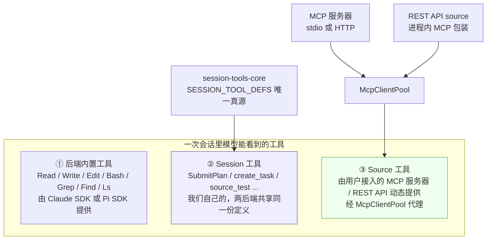

# 09 · 工具、Source 与 MCP

> 基于上游 craft-agents-oss v0.11.4 · 核验于 2026-08-08

Agent 能做什么，取决于它手上有哪些工具。这一篇讲工具从哪来、怎么加、怎么被权限系统拦。

## 工具的三个来源



**做二次开发时，「加一个业务能力」通常落在 ② 或 ③：**

- 能力属于产品本身、所有用户都该有 → 加 **session 工具**（②），改代码
- 能力是接某个外部系统、按用户/workspace 配置 → 加 **source**（③），通常不用改代码

## ② Session 工具

### 唯一真源：`SESSION_TOOL_DEFS`

全部定义在 `packages/session-tools-core/src/tool-defs.ts` 的一个数组里。**两个后端都从这里取**，所以工具集天然对齐（有 `session-tool-parity.test.ts` 守着）。

一条定义长这样：

```ts
{
  name: 'source_test',
  description: TOOL_DESCRIPTIONS.source_test,
  inputSchema: SourceTestSchema,        // zod schema
  executionMode: 'registry',            // 'registry' | 'backend'
  safeMode: 'allow',                    // 'allow' | 'block'
  readOnly: true,                       // 可选，只读工具可并行执行
  handler: handleSourceTest,            // registry 模式必须有；backend 模式必须是 null
}
```

四个字段的含义：

| 字段 | 取值 | 含义 |
|---|---|---|
| `executionMode` | `'registry'` | 由 `session-tools-core` 的 handler 直接执行，两后端行为完全一致。**默认选这个** |
| | `'backend'` | 必须由后端适配器各自实现（如 `call_llm`、`browser_tool` —— 需要后端自己的运行时能力）。`handler` 必须为 `null`，且**两个后端都要实现，否则 parity 测试红** |
| `safeMode` | `'allow'` | `safe`（Explore）模式下允许调用 |
| | `'block'` | `safe` 模式下拦截。凡是有副作用的都该是 `block` |
| `readOnly` | `true` | 声明无副作用，支持并行调用的后端会并行执行 |

由这个数组自动派生出一堆集合，不要手写重复的清单：

```ts
SESSION_TOOL_NAMES              // 全部工具名
SESSION_BACKEND_TOOL_NAMES      // executionMode === 'backend'
SESSION_REGISTRY_TOOL_NAMES     // executionMode === 'registry'
SESSION_SAFE_ALLOWED_TOOL_NAMES // safeMode === 'allow'
SESSION_SAFE_BLOCKED_TOOL_NAMES // safeMode === 'block'
SESSION_TOOL_REGISTRY           // Map<name, def>，O(1) 查找
```

### 当前的 28 个 session 工具

| 分类 | 工具 |
|---|---|
| 计划 | `SubmitPlan` |
| 校验 | `config_validate`、`skill_validate`、`mermaid_validate` |
| Source | `source_test`、`source_oauth_trigger`、`source_google_oauth_trigger`、`source_slack_oauth_trigger`、`source_microsoft_oauth_trigger`、`source_credential_prompt` |
| 会话自管理 | `get_session_info`、`list_sessions`、`set_session_labels`、`set_session_status`、`archive_session`、`spawn_session` |
| 任务 | `create_task`、`list_background_tasks` |
| 数据处理 | `transform_data`、`script_sandbox`、`render_template` |
| 消息 | `send_agent_message`、`list_messaging_channels`、`unbind_messaging_channel` |
| 其它 | `call_llm`、`browser_tool`、`update_user_preferences`、`send_developer_feedback` |

### 加一个 session 工具

四步，全在 `packages/session-tools-core/`：

1. `src/tool-defs.ts` 加 zod schema
2. `src/handlers/my-tool.ts` 写 handler，从 `src/handlers/index.ts` 导出
3. `src/tool-defs.ts` 的 `SESSION_TOOL_DEFS` 加一条
4. 工具描述加进 `TOOL_DESCRIPTIONS`

**不需要分别改两个后端** —— Claude 侧通过 `createSdkMcpServer()` 从注册表生成，Pi 侧通过 `backend/pi/session-tool-defs.ts` 的 `getSessionToolProxyDefs()` 生成（自动加 `mcp__session__` 前缀）。

完整步骤与验证见教程 [加一个业务工具](14-walkthroughs/add-tool.md)。

> ⚠️ **`executionMode: 'backend'` 是高成本选项。** 选它意味着 Claude 侧和 Pi 侧各写一遍实现，而且这两处代码在上游同步时都是手工合并区。除非工具真的需要后端运行时才有的能力（模型调用、浏览器实例），否则一律用 `'registry'`。

## ③ Source

### 三种类型

Source 是外部系统的接入点，物理上是 `~/.craft-agent/workspaces/{ws}/sources/{slug}/` 一个目录：

```
sources/linear/
├── config.json    源配置
└── guide.md       使用说明 + 缓存数据（YAML frontmatter）
```

`type` 字段固定三选一（**这是硬约束，不要新增**）：

| type | 说明 | 配置块 |
|---|---|---|
| `mcp` | MCP 服务器。HTTP 或本地 stdio 子进程 | `config.mcp` |
| `api` | REST API。带认证方式与端点定义，被包装成进程内 MCP | `config.api` |
| `local` | 本地文件系统（目录、Obsidian 库、Git 仓库） | `config.local` |

`FolderSourceConfig` 的其它关键字段：`provider`（自由文本标签）、`enabled`、`icon`（emoji 或 URL）、`tagline`（给模型看的一句话说明，不填就从 `guide.md` 第一段提取）、`brand.color`、`isAuthenticated` / `connectionStatus` / `connectionError` / `lastTestedAt`。

### `guide.md` 是给模型看的

不只是文档 —— 它会被注入到上下文里，告诉模型这个 source 能干什么、怎么用、有什么坑。YAML frontmatter 里还能塞缓存数据（比如预取的项目列表）。

**接内部系统时，`guide.md` 的质量直接决定模型用得对不对。** 这比写代码重要。

### 认证与凭据

- 凭据由 `SourceCredentialManager`（`sources/credential-manager.ts`）管理，加密存储，不落在 `config.json`
- OAuth：Google / Slack / Microsoft 有专门流程，其余走 `generic-oauth.ts`
- **Renew endpoint**：自定义 bearer token API 可以配 `api.renewEndpoint`，把当前 token 发过去换新的，不需要 refresh token
- `isRefreshableSource()` 是「这个 source 能不能自动刷新」的**唯一判断入口**，`TokenRefreshManager` 定期驱动

> WebUI 的 source OAuth 走一个固定的中继回调地址 `https://api-aidp.hxsyai.com/v1/auth/callback` —— **这是必须解耦的 Craft 绑定点之一**，见 [13-branding-decoupling](13-branding-decoupling.md)。

## MCP 连接池

`packages/shared/src/mcp/mcp-pool.ts` 的 `McpClientPool` 管理所有 source 的 MCP 连接，把它们的工具统一代理出去。

### 代理工具名：只能用一个构造器

MCP 允许工具名里有点（`pat.batch_plan`），但 OpenAI / Codex（走 Pi 路径）拒绝 `[a-zA-Z0-9_-]` 之外的字符。所以要做净化：

```ts
export function proxyToolName(slug: string, toolName: string): string {
  return `mcp__${slug}__${toolName}`.replace(/[^a-zA-Z0-9_-]/g, '_')
}
```

**这个名字是不透明的精确匹配键。** `McpClientPool.proxyTools` 用它映射到 `{ slug, originalName }`，`callTool` 原样查表再用未改动的 `originalName` 去调真实工具。

> 构造（`registerClient`）、暴露（`getProxyToolDefs`）、Pi 侧注册、Claude 侧 `pool.callTool` —— **这四处必须全部用 `proxyToolName()` 这一个构造器**，否则派发键会漂移（#864，是 #498 的回归）。
>
> 净化后如果撞名，保留**第一个**并 `console.warn` 跳过的那个 —— 静默消失的工具必须留痕。

### Source 的热装载

会话运行中启用/停用 source 会走 `AgentBackend.setSourceServers(mcpServers, apiServers, intendedSlugs)`：

- `mcpServers` —— 已经带好认证头的 MCP 服务器配置
- `apiServers` —— REST API 包装成的进程内 MCP 服务器
- `intendedSlugs` —— 应当处于激活状态的 source 列表

模型在对话中途要求启用某个 source 时，会发出 `source_activated` 事件，走 `AbortReason.SourceActivated` 的重启路径带上新工具。

## 权限系统

`PermissionManager`（`packages/shared/src/agent/core/permission-manager.ts`）是工具调用的闸门。

### 三档模式（固定，不可扩展）

| 模式 | 界面名 | 行为 |
|---|---|---|
| `safe` | Explore | 只读。所有写操作被拦截；session 工具按 `safeMode` 字段过滤 |
| `ask` | Ask to Edit | **默认**。需要授权时发 `permission_request` 事件等用户批准 |
| `allow-all` | Auto | 全自动放行 |

SHIFT+TAB 循环。可循环的模式集合由 workspace 的 `defaults.cyclablePermissionModes` 决定（至少 2 个）。

### 评估逻辑

`evaluateToolCall()` 是入口。对 Bash 命令有一套专门的分析：

| 方法 | 作用 |
|---|---|
| `checkBashCommand()` | 综合检查，返回拒绝原因或 `null` |
| `getBaseCommand()` | 从完整命令行提取基础命令（`git commit -m x` → `git`） |
| `isDangerousCommand()` | 危险命令识别 |
| `extractDomainFromNetworkCommand()` | 从 `curl` / `wget` 之类里提域名，用于域名白名单 |
| `isApiEndpointAllowed()` | REST API source 的方法 + 路径级放行 |
| `whitelistCommand()` / `whitelistDomain()` | 会话内的临时白名单（用户点「记住」时写入） |

Bash 命令解析在 `agent/bash-validator.ts`（Windows 下另有 `powershell-validator.ts` + `powershell-parser.ps1`）。

规则持久化在 `~/.craft-agent/permissions/`。

### 一个容易被忽略的细节

`agent/backend/read-patterns.ts` 会识别「其实是在读文件的 bash 命令」（`cat`、`head`、`tail` 等），把它们按 Read 工具展示和判权。所以 `safe` 模式下 `cat file.txt` 是放行的，`rm file.txt` 不是。

加新的读类命令模式时改这个文件，不要在权限逻辑里散写特判。

## 文档处理工具链

除了 session 工具和 Source 工具，还有一组**命令行工具**，Agent 通过 Bash 调用它们处理文档。

八个工具，都在 `apps/electron/resources/bin/`（每个配一份 `.cmd` 供 Windows 用）：

| 工具 | 能力 | Python 实现 |
|---|---|---|
| `markitdown` | 任意文档转 Markdown（`.docx` / `.xlsx` / `.pptx` / `.pdf` / `.html` / `.ipynb`） | `markitdown_cli.py` |
| `pdf-tool` | PDF 提取文本、合并、拆分、查信息 | `pdf_tool.py` |
| `xlsx-tool` | 读写导出表格（`.xlsx` / `.csv`） | `xlsx_tool.py` |
| `docx-tool` | 创建与修改 Word 文档，支持基础格式 | `docx_tool.py` |
| `pptx-tool` | 读取与检查 PPT 内容 | `pptx_tool.py` |
| `img-tool` | 图片缩放、转换、提取元数据（`.png` / `.jpg` / `.webp` / `.gif` / `.svg`） | `img_tool.py` |
| `doc-diff` | 比较两个文档的差异 | `doc_diff.py` |
| `ical-tool` | 解析日历文件（`.ics`） | `ical_tool.py` |

Python 脚本在 `apps/electron/resources/scripts/`，全部支持 `--help`。

**运行时是打包进来的 `uv`**（首次 `electron:dev` 会自动下载到 `apps/electron/resources/bin/<platform>-<arch>/`），不依赖用户机器上的 Python。

冒烟测试：

```bash
bun run test:doc-tools     # 已接进 validate:dev / validate:ci
```

> 加新文档工具：写 `resources/scripts/xxx_tool.py` + `resources/bin/xxx-tool` 与 `.cmd` 包装 + 在 `electron-builder.yml` 的 `files` 里登记 + 补一个 smoke test 并加进 `test:doc-tools`。用法层面靠工具自己的 `--help` 让模型发现，不需要注册成 session 工具。

## Skills

Skill 是给模型读的提示词包，不是代码插件。

```
skills/my-skill/
└── SKILL.md      YAML frontmatter + Markdown 正文
```

frontmatter 字段（`packages/shared/src/skills/types.ts`）：

| 字段 | 说明 |
|---|---|
| `name` | 显示名 |
| `description` | 列表里的简介，也是模型判断何时该用它的依据 |
| `globs` | 可选，触发该 skill 的文件模式 |
| `alwaysAllow` | 可选，该 skill 激活时始终放行的工具 |
| `icon` | 可选，**只支持 emoji 或 URL**，不支持相对路径和内联 SVG |
| `requiredSources` | 可选，激活该 skill 时自动启用的 source slug |

三级作用域：`global`（`~/.agents/`）、`workspace`（workspace 目录下）、`project`（`{project}/.agents/`）。

> 注意：全局与项目级 skill 都注册在名为 `.agents` 的目录下，SDK 从 `path.basename()` 推插件名，**两级会解析成同一个插件名 `.agents:skillSlug`**。

## 排查清单

| 症状 | 看哪里 |
|---|---|
| 工具在 Claude 有、Pi 没有（或反过来） | `session-tool-parity.test.ts` 应已变红；多半是加了 `executionMode: 'backend'` 却只实现一边 |
| MCP 工具调用报「找不到工具」 | 有地方没走 `proxyToolName()`，派发键漂移了 |
| 某个 MCP 工具凭空消失 | 净化后撞名，被保留了第一个；看 `console.warn` |
| `safe` 模式下工具意外被拦/放行 | 该工具定义的 `safeMode` 字段；bash 命令看 `read-patterns.ts` |
| Source 认证过期后不自动刷新 | `isRefreshableSource()` 是否认它；renew endpoint 是否配了 |
| 会话中途启用 source 没生效 | `setSourceServers` 的 `intendedSlugs`，以及是否走到了 `SourceActivated` 重启 |
