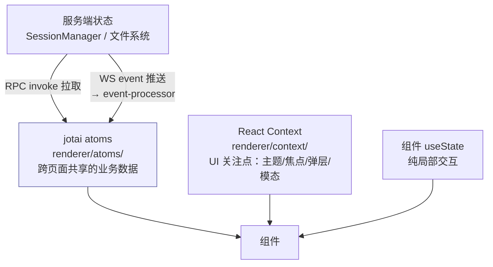

# 11 · 渲染层与 UI

> 基于上游 craft-agents-oss v0.11.4 · 核验于 2026-08-08

技术栈：React 18 + Vite + Tailwind v4 + jotai + Radix + shadcn(new-york)。

操作层面的约定（组件放哪个目录、shadcn 怎么加、playground 怎么用）在 `.claude/skills/ui-components`，本篇不复述。这里讲**结构**：状态怎么流、事件怎么进来、路由怎么走、i18n 怎么落。

## 目录结构

```
apps/electron/src/renderer/
├── App.tsx                 应用根
├── main.tsx                入口
├── pages/                  页面级组件
│   ├── ChatPage.tsx
│   ├── ProjectInfoPage.tsx / SourceInfoPage.tsx / SkillInfoPage.tsx
│   ├── ShortcutsPage.tsx
│   └── settings/           设置页（按 SETTINGS_PAGES 注册）
├── components/             功能组件，按域分目录
│   ├── ui/                 shadcn 组件（40+），仅渲染进程用
│   ├── chat/  app-shell/  browser/  settings/  automations/
│   ├── projects/  messaging/  onboarding/  right-sidebar/  workspace/
│   └── markdown/  files/  preview/  icons/  shiki/  info/  apisetup/
├── atoms/                  jotai 全局状态
├── context/                React Context（UI 局部关注点）
├── contexts/               NavigationContext（路由）
├── hooks/                  30+ 自定义 hook
├── event-processor/        Agent 事件流处理 ★
├── actions/  lib/  utils/  config/
└── playground/             组件预览页
```

> ⚠️ **`context/` 和 `contexts/` 是两个目录**，不是笔误。`contexts/`（复数）只放导航相关（`NavigationContext.tsx`、`navigation-history.ts`、`navigation-reconcile.ts`）；`context/`（单数）放其余的 UI Context（`ThemeContext`、`ModalContext`、`FocusContext`、`AppShellContext`、`SessionListContext`、`DismissibleLayerContext`、`EscapeInterruptContext`、`StoplightContext`）。这是上游遗留，容易找错。

## 状态分层

这个项目的状态分三层，各有明确职责，混用会很难调：



**jotai atoms**（`renderer/atoms/`）：`sessions`、`sources`、`skills`、`projects`、`automations`、`messaging`、`kanban`、`browser-pane`、`overlay`、`panel-stack`、`background-finished`、`workspace-avatar-colors`。

判断规则：

| 状态性质 | 放哪 |
|---|---|
| 来自服务端、多个页面要用 | jotai atom |
| 纯 UI 关注点、需要跨层级传递（主题、焦点、模态栈） | React Context |
| 只有当前组件和它的直接子组件用 | `useState` |

## Agent 事件流：`event-processor`

这是渲染层最核心的一块。服务端推来的 `AgentEvent` 全部经过它，才变成 UI 上的消息。

```
WS event ('session:event')
   ▼
useEventProcessor.ts        订阅并驱动
   ▼
processor.ts                纯函数：(SessionState, AgentEvent) → ProcessResult
   ├── handlers/text.ts     text_delta / text_complete
   ├── handlers/tool.ts     tool_start / tool_result / task_* / shell_*
   └── handlers/session.ts  其余全部（状态、标签、权限、认证、标题…）
   ▼
新的 SessionState（永远是新引用）
   ▼
jotai atom 更新 → React 重渲染
```

设计上的四条硬约束，改这块之前必须知道：

1. **`processor.ts` 是纯函数** —— 不做 IO、不发 RPC、不碰 DOM。副作用由调用方根据 `ProcessResult` 执行
2. **永远返回新引用** —— 否则 jotai 不会触发更新
3. **消息按 ID 查找，绝不按位置** —— 位置在流式过程中会变
4. **单一更新路径** —— 所有事件走同一个函数，避免竞态

`handlers/session.ts` 里有 40+ 个 handler，加新事件类型时在这里加分支。

### 一个需要小心的点：乐观更新的对账

用户发消息时，UI 会先乐观地挂一条本地消息。服务端随后推回一条 `user_message` 事件（`status: 'processing'`）作为对账点：

> **`handleUserMessage` 必须把服务端那条消息的权威时间戳拷到已挂载的乐观消息上，同时保留乐观消息的 ID。**

只在服务端重新盖时间戳、不同步给前端，会出现「刷新后顺序对、当场看着不对」。相关背景（mid-stream 插话的重新盖戳）见 `packages/shared/CLAUDE.md`。

## 路由

自研的类型安全路由，不是 react-router。

- **定义**：`apps/electron/src/shared/routes.ts` —— `routes` 对象里全是 builder 函数
- **解析**：`apps/electron/src/shared/route-parser.ts`
- **状态**：`renderer/contexts/NavigationContext.tsx`
- **命令式跳转**：`renderer/lib/navigate.ts` 的全局 `navigate()`

两类路由：

```ts
// action/{name}[/{id}] —— 触发副作用
navigate(routes.action.newSession({ input: '你好', send: true }))
navigate(routes.action.renameSession(id, '新名字'))

// {filter}[/session/{sessionId}] —— 视图路由，承载完整导航状态
navigate(routes.view.allSessions())
navigate(routes.view.settings('shortcuts'))
```

**不要手拼路由字符串**，一律用 builder —— 类型安全，且上游改格式时有编译期保护。

深链（`huaxiaozhu://`）由主进程的 `deep-link.ts` 解析后转成同一套路由。

## 设置页

`apps/electron/src/shared/settings-registry.ts` 是唯一真源。加一个设置页只需四步（文件头注释里写着）：

1. `SETTINGS_PAGES` 加一条 `{ id, labelKey, descriptionKey }`
2. `renderer/pages/settings/` 建页面组件
3. `renderer/pages/settings/settings-pages.ts` 的 `SETTINGS_PAGE_COMPONENTS` 加映射
4. `renderer/components/icons/SettingsIcons.tsx` 的 `SETTINGS_ICONS` 加图标

**类型、路由、校验全部自动派生**，不需要改别的地方。

> `labelKey` / `descriptionKey` 是 i18n key，**在渲染时才用 `t()` 解析**。这个模块在 i18n 初始化之前就加载，模块级调 `i18n.t()` 会拿到未翻译的 key。

现有 11 个页：`app`、`ai`、`appearance`、`input`、`workspace`、`permissions`、`labels`、`messaging`、`server`、`shortcuts`、`preferences`。

## 组件的两个家

| 位置 | 用途 | 约束 |
|---|---|---|
| `apps/electron/src/renderer/components/` | 渲染进程专用（含 `ui/` 下的 shadcn 组件） | 可以用 Electron API |
| `packages/ui/src/components/` | 三端共享 | **不得引用 Electron API 或 Node 内置模块**；**必须在 `packages/ui/package.json` 的 `exports` 里登记** |

`packages/ui` 的 `exports` 是白名单，当前 10 条：

```
.  ./chat  ./chat/SessionViewer  ./chat/TurnCard  ./chat/turn-utils
./markdown  ./annotations/follow-up-state  ./ui/drawer  ./context  ./styles
```

**没登记的路径外部 import 不到**，报错信息还相当不直观。

判断规则：只有 Electron 渲染进程用 → 放 `apps/electron`；webui 或 viewer 也要用 → 放 `packages/ui`。拿不准先放 `apps/electron`，反向迁移（从 `packages/ui` 拆掉 Electron 依赖）代价大得多。

## i18n

7 个 locale：`en`（基准）、`zh-Hans`、`de`、`es`、`hu`、`ja`、`pl`。

**完整约定在 `packages/shared/CLAUDE.md`**（key 前缀表、复数、`<Trans>` 用法、跨进程语言持久化、翻译长度对 UI 的影响），维护得很好，这里只提三条最容易踩的：

1. **绝不在模块级调 `i18n.t()`** —— 存 `labelKey` 字符串，在组件/函数里解析
2. **新增 key 必须补齐全部 7 个文件**，只改 `zh-Hans.json` 会让 `lint:i18n:parity` 失败
3. **品牌名保持英文**：Craft、Workspace、Claude、Anthropic、OpenAI、MCP、API、SDK

三个校验脚本：`lint:i18n:sorted`（排序）、`lint:i18n:parity`（各 locale key 一致）、`lint:i18n:coverage`（代码里引用的 key 在 `en.json` 存在）。

## 外观定制：主题 / 颜色 / 图标

三套相关但独立的机制。用户操作层面见官方文档 <https://docs-aiadp.hxsyai.com/docs/customisation/themes>（含 themes / colors / icons 三篇），这里讲代码落点。

### 主题

**级联**：应用级 + workspace 级，workspace 的 `defaults.colorTheme` 覆盖应用的 `colorTheme`。

| 位置 | 内容 |
|---|---|
| `~/.craft-agent/themes/` | 用户主题目录，首次启动从内置资源播种 |
| `apps/electron/resources/` | 内置预置主题（`dracula`、`nord` 等）的来源 |
| `renderer/context/ThemeContext.tsx` + `hooks/useTheme.ts` | 渲染侧 |
| `renderer/index.css` | Tailwind v4 + CSS variables 全局入口 |
| `theme` 域 RPC 信道 | 含 `BROADCAST_PREFERENCES` / `PREFERENCES_CHANGED`，多窗口同步 |

### 颜色

`packages/shared/src/colors/`，独立于主题的一层 —— 用于给 workspace、source、project、label 这些**实体**上色。

| 文件 | 职责 |
|---|---|
| `types.ts` | `EntityColor` —— 可以是系统色名（`"accent"`、`"info"`）或自定义的 `{ light, dark }` 值对 |
| `defaults.ts` | 默认色板 |
| `resolve.ts` | 解析成实际色值 |
| `validate.ts` | 校验 |
| `migrate.ts` | 老格式迁移 |

实体上的用法例如 `FolderSourceConfig.brand.color`、`ProjectConfig` 的看板列 `color`。**不设时默认 `"accent"`**。

### 图标

`packages/shared/src/icons/` + `~/.craft-agent/tool-icons/`（首次启动播种内置 SVG）。

Source 与 Skill 的 `icon` 字段**只支持 emoji 或 URL**，不支持相对路径和内联 SVG；URL 会被自动下载成 `icon.{ext}`。优先级：emoji > URL > 目录里自动发现的本地文件。

> 换品牌时这三处都要动，清单见 [13-branding-decoupling](13-branding-decoupling.md)。

## 开发回路

```bash
bun run playground:dev     # 只看组件，秒级热更，不启动 Electron
```

registry 在 `renderer/playground/registry/`（30 个条目）。新增组件时加一条，就能隔离预览各种状态。

⚠️ 与 `electron:dev` 抢 5173，且启动时会 `kill -9` 占用者。二选一。

## 排查清单

| 症状 | 看哪里 |
|---|---|
| 组件不重渲染 | event-processor 返回了同一个引用 |
| 流式消息顺序错乱 | 有代码按位置而不是按 ID 找消息 |
| 发消息后本地那条闪一下才归位 | `handleUserMessage` 的乐观消息对账 |
| `packages/ui` 的新组件 import 不到 | `package.json` 的 `exports` 没登记 |
| webui / viewer 编译失败 | 共享组件里引了 Electron API 或 Node 模块 |
| 设置页加了但导航里没有 | `SETTINGS_PAGES` 或 `SETTINGS_PAGE_COMPONENTS` 漏了一处 |
| 界面上显示的是 i18n key 而不是文案 | 模块级调了 `i18n.t()`，或 key 没加进 `en.json` |
| 找不到某个 Context | `context/` 与 `contexts/` 是两个目录 |
