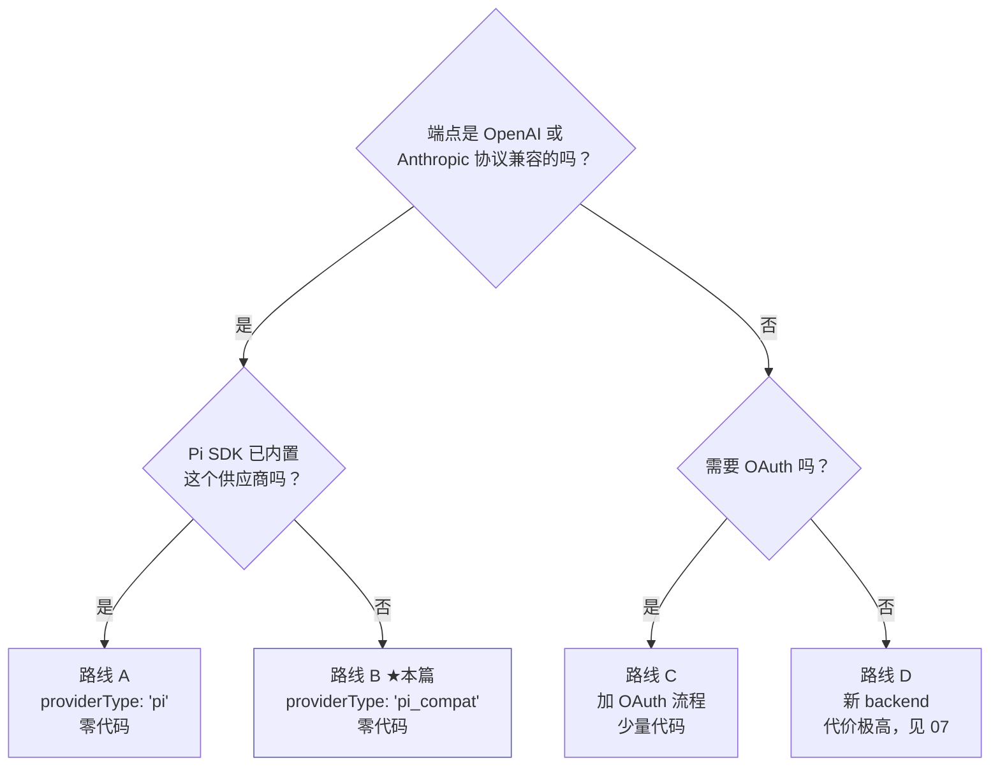

# 教程 · 接入自建模型端点

> 基于上游 craft-agents-oss v0.11.4 · 核验于 2026-08-08

**目标**：把一个内部的 OpenAI 兼容模型网关接进来，能在会话里选用。

**先说结论：这件事通常不需要写代码。** 走 `pi_compat` 连接即可。下面先讲零代码路径，再讲什么情况下需要动代码。

先读 [08-models-providers](../08-models-providers.md) 建立概念。

## 路线判断



绝大多数内部网关（vLLM、Ollama、one-api、各家云厂商的兼容层）都落在路线 B。

## 路线 B · 零代码接入

### 方式一：界面配置（推荐先用这个验证）

设置 → AI → 添加连接 → 选自定义端点，填：

| 字段 | 值 |
|---|---|
| 名称 | 内部模型网关 |
| Base URL | `https://llm.internal.example.com/v1` |
| API Key | 你的密钥 |
| 协议 | OpenAI Completions（或 Anthropic Messages） |
| 模型列表 | 手工填模型 ID |

配完点「测试连接」，通了就能在会话里选。

### 方式二：直接写配置（批量部署用）

`~/.craft-agent/config.json` 的 `llmConnections` 数组里加一条：

```jsonc
{
  "slug": "internal-gateway",
  "name": "内部模型网关",
  "providerType": "pi_compat",
  "authType": "api_key_with_endpoint",
  "baseUrl": "https://llm.internal.example.com/v1",
  "customEndpoint": {
    "api": "openai-completions",   // 或 "anthropic-messages"
    "supportsImages": false        // 端点级默认，必须显式声明
  },
  "models": [
    { "id": "internal-large", "contextWindow": 128000, "supportsImages": true },
    { "id": "internal-vision", "contextWindow": 32000,  "supportsImages": true },
    "internal-small"               // 字符串形式：用默认能力
  ],
  "defaultModel": "internal-large",
  "createdAt": 1754620000000
}
```

**API Key 不写在这里** —— 它加密存在 `credentials.enc`，键名由 `getLlmCredentialKey(slug, 'api_key')` 生成。批量部署时通过 `LLM_Connection:save` RPC 或应用界面写入。

### 模型能力的解析规则

在 `packages/pi-agent-server/src/custom-endpoint-models.ts` 的 `buildCustomEndpointModelDef()` 里：

```ts
const supportsImages = overrides?.supportsImages   // 单个模型上的设置
                    ?? defaults?.supportsImages    // customEndpoint.supportsImages
                    ?? false                       // 兜底
contextWindow = overrides?.contextWindow ?? 131_072   // 默认 128K
maxTokens = 8_192
```

三条要点：

1. **图片支持默认关闭**，且**不会自动探测** —— 端点无法查询能力，只能显式声明
2. **单模型的 `supportsImages: false` 能覆盖端点级的 `true`** —— 这是刻意支持的，用于「网关整体支持视觉但某个模型是纯文本」的情况
3. 模型 id 上的 `pi/` 前缀会被 `stripPiPrefix()` 剥掉，写不写都行

## 验证

### 1. 连接层

设置页点「测试连接」，或走 RPC `LLM_Connection:test`。

失败时先确认：

```bash
# 端点本身通不通（绕过应用）
curl -s https://llm.internal.example.com/v1/models \
  -H "Authorization: Bearer $KEY" | head
```

### 2. 会话层

新建会话 → 选这个连接 → 发一句话。

看日志确认走的是 Pi 子进程：

```bash
tail -f ~/Library/Logs/@craft-agent/electron/main.log | grep -i "pi\|spawn"
```

### 3. 能力层

- 模型标了 `supportsImages: true` → 试着拖一张图进去，应该能发
- 标了 `false` → 附件区应该拒绝图片（**会话层在发送时还会兜一道**，即使子进程能力刷新失败也不会把图片发出去）

## 常见问题

### `Stream ended without finish_reason`

自建 OpenAI 兼容端点最常见的错误。根因通常是网关返回的 SSE 流里，终止 chunk 同时带了空的 `tool_calls: []`。

上游已经修过（`unified-network-interceptor.ts` 的 `createOpenAiSseStrippingStream`：空数组不算工具调用增量，转发时还会把空 `tool_calls` 键整个剥掉）。仍然报这个错的话：

1. 确认走的是 Pi 后端 —— **拦截器只对 Pi 生效**，Claude 会话享受不到这个修复
2. 抓一下网关实际返回的 SSE，对比 OpenAI 官方格式
3. 详细背景见 `packages/shared/CLAUDE.md` 里 OpenAI SSE 剥离流那一条

### 并行工具调用出现重复的空 id 条目

同一处修复覆盖的另一个症状 —— 网关把一次工具调用拆成「初始化 + 纯参数增量」两个事件，Pi SDK 会当成两次调用。

上游的处理是**每个逻辑工具调用只发一个合并后的 SSE 事件**（`id + name + cleanArgs` 一起）。历史会话被旧版本写坏的，有 `sanitizeOpenAiHistoryInPlace` 修复。

### 改了连接配置但会话没生效

`update_runtime_config` 只能热更 `model` / `providerType` / `authType` / `baseUrl` / `customEndpoint` / `customModels`。

`piAuthProvider`、`slug` 这类改不了 —— `runtime-config.ts` 的 `buildRestartRequiredSignature()` 判定签名变化后会销毁重建后端。如果你新加了一个字段却发现热更不生效，问题多半是它没被纳入 restart signature。

### 模型列表里看不到

- 检查 `models` 数组是否填了
- 检查是否命中排除清单：`PI_EXCLUDED_MODELS`、`PI_EXCLUDED_MODEL_PREFIXES`（`packages/shared/src/config/models-pi.ts`）
- 注意 `gpt-4` 是被前缀排除的 —— 如果你的网关模型名以 `gpt-4` 开头会被过滤掉

## 什么时候才需要写代码

| 需求 | 落点 |
|---|---|
| 端点需要 OAuth 授权 | `packages/shared/src/auth/` 加流程，参考 `generic-oauth.ts` |
| 需要自定义请求头 / 签名 | Pi 侧走 `unified-network-interceptor.ts`（**Claude 侧无效**） |
| 需要在 UI 上做成一个「预置供应商」 | `models-pi.ts` 的 `PI_PROVIDER_DISPLAY` + 相关设置页 |
| 想给连接加新的持久化字段 | `LlmConnection` 加字段，**同时加进 `updateLlmConnection` 的白名单**，否则保存后静默丢失（#838） |
| 协议完全不兼容 | 才考虑新 backend，代价见 [07-agent-core](../07-agent-core.md) |

## 检查清单

```bash
bun run typecheck:all
cd packages/shared && bun test src/config
cd packages/pi-agent-server && bun test           # 自定义端点模型解析的测试在这
```

改动涉及 `packages/shared/src/**` 且被 `pi-agent-server` 引用时：

```bash
bun run server:build:subprocess     # 否则子进程跑的是旧代码
```
