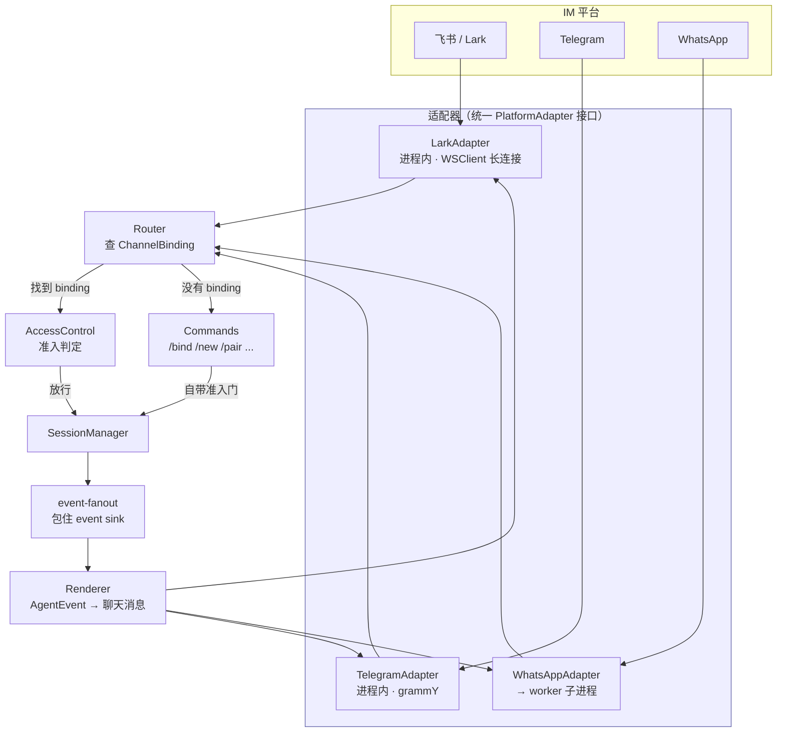

# 16 · 消息网关（Messaging）

> 基于上游 craft-agents-oss v0.11.4 · 核验于 2026-08-09

把 Agent 会话接到即时通讯软件，让人在飞书 / Telegram / WhatsApp 里直接跟 Agent 对话。

> **本篇讲代码结构与扩展点。** 「怎么在飞书开放平台建机器人」这类操作步骤见官方文档 <https://agents.craft.do/docs/messaging/overview>（含 Lark/Feishu、Telegram、WhatsApp 三篇），本篇不复述。

## 先分清两条链路

这是最容易混淆的地方：

| | 远程服务端连接 | **消息网关** |
|---|---|---|
| 连的是谁 | 本产品自己的桌面客户端 / CLI | 飞书、Telegram、WhatsApp |
| 协议 | 自建 WS RPC | 各平台自己的 SDK |
| 代码 | `server-core/transport/` | `packages/messaging-gateway/` |
| 用途 | 算力放服务器，客户端当前端 | 人在 IM 里跟 Agent 对话 |

飞书用户**不会**「连到你的服务器」，而是在飞书里 @ 机器人。远程连接见 [12-build-deploy](12-build-deploy.md#桌面客户端怎么连远程服务端)。

## 整体链路



## 包结构

`packages/messaging-gateway/src/`，约 6300 行：

| 文件 | 行数 | 职责 |
|---|---|---|
| `registry.ts` | 1580 | `MessagingGatewayRegistry` —— 按 workspace 管理网关实例，最重的一个文件 |
| `gateway.ts` | 813 | `MessagingGateway` —— 单个 workspace 的网关，装配适配器与各组件 |
| `renderer.ts` | 785 | 把 `AgentEvent` 流渲染成聊天消息（含各平台的 Markdown 方言） |
| `commands.ts` | 682 | 斜杠命令：`/bind` `/unbind` `/new` `/pair` `/status` `/stop` `/help` |
| `types.ts` | 518 | 全部契约：`PlatformAdapter`、`BindingConfig`、`MessagingConfig` 等 |
| `binding-store.ts` | 293 | 频道 ↔ 会话绑定的持久化 |
| `pending-senders.ts` | 249 | 待确认发送者 |
| `access-control.ts` | 239 | 准入判定 |
| `topic-registry.ts` | 206 | Telegram 论坛话题（每会话一个 topic） |
| `pairing.ts` | 194 | 配对码生成与消费 |
| `router.ts` | 174 | 入站消息路由 |
| `bootstrap.ts` | 118 | **两个宿主共用的装配入口** |
| `config-store.ts` | 111 | workspace 级 messaging 配置 |
| `plan-tokens.ts` | 83 | 计划审批的令牌 |
| `event-fanout.ts` | 36 | 把网关的事件消费包进 event sink |

数据落在 `~/.craft-agent/workspaces/{ws}/messaging/`，日志在 `~/.craft-agent/logs/messaging-gateway.log`。

## 三个适配器

全部实现 `PlatformAdapter`（`types.ts`）：

```ts
interface PlatformAdapter {
  readonly platform: PlatformType          // 'telegram' | 'whatsapp' | 'lark'
  readonly capabilities: AdapterCapabilities

  initialize(config: PlatformConfig): Promise<void>
  destroy(): Promise<void>
  isConnected(): boolean

  onMessage(handler): void
  onButtonPress(handler): void

  sendText(channelId, text, opts?): Promise<SentMessage>
  editMessage(channelId, messageId, text, opts?): Promise<void>
  sendButtons(channelId, text, buttons, opts?): Promise<SentMessage>
  sendTyping(channelId, opts?): Promise<void>
  sendFile(channelId, file, filename, caption?, opts?): Promise<SentMessage>

  // 可选 —— 平台没有对应能力时可以不实现或做成空操作
  clearButtons?(channelId, messageId, opts?): Promise<void>
  setAcceptedSupergroupChatId?(chatId: string | undefined): void   // Telegram
  createForumTopic?(chatId, name): Promise<{ threadId, name }>     // Telegram
  handleWebhook?(request: Request): Promise<Response>              // Telegram，headless 用
}
```

### 能力对比

| | `lark` | `telegram` | `whatsapp` |
|---|---|---|---|
| 运行方式 | 进程内，`@larksuiteoapi/node-sdk` 的 `WSClient` 长连接 | 进程内，grammY | **独立 worker 子进程**（Baileys 依赖太重） |
| `messageEditing` | ✅ | ✅ | ❌ |
| `inlineButtons` | ✅ | ✅ | ❌ |
| `maxMessageLength` | 30000 | — | — |
| `markdown` | `lark-post` | `v2` | `whatsapp` |
| `webhookSupport` | ❌ | ❌ | ❌ |

> **三者 `webhookSupport` 都是 `false`** —— 全部走长轮询/长连接，**不需要公网可达的回调地址**。这对桌面应用和内网部署都是正确的选择：不用给 IM 平台开放入站端口。
>
> （`PlatformAdapter.handleWebhook?` 这个可选方法是给 headless 服务端留的口子，但当前没有适配器把 `webhookSupport` 置为 `true`。）

### Lark 与飞书是两个独立生态

共用同一套 SDK 和协议，但机器人只能注册在其中一个开放平台。由配置里的 `domain` 区分：

```ts
lark?: {
  enabled: boolean
  domain?: 'lark' | 'feishu'   // lark   → open.larksuite.com（国际版）
                                // feishu → open.feishu.cn（中国版）
}
```

内网/国内部署要接的是 `'feishu'`。

### WhatsApp 为什么是子进程

Baileys 依赖过重，打进主进程会有 bundling 问题。`bootstrap.ts` 里要传 worker 入口路径和 Node 二进制：

```ts
whatsapp: {
  workerEntry: '<绝对路径>/worker.cjs',
  nodeBin?: string,        // Electron 可省（默认 process.execPath，会以 ELECTRON_RUN_AS_NODE 重入）
                           // Bun 宿主必须显式传 'node' 或路径 —— Bun 自己跑不了它
  pairingMode?: 'qr' | 'code',
}
```

## 装配：两个宿主必须走同一个入口

```ts
const handle = createMessagingBootstrap({ ... })                     // bootstrapServer 之前
const deps   = { ..., messagingRegistry: handle.registry }           // 进 createHandlerDeps
sink = handle.wrapSink(baseSink)                                     // 进 setSessionEventSink
handle.setPublisher(instance.wsServer.push.bind(instance.wsServer))  // bootstrapServer 之后
await handle.initializeWorkspaces(workspaceIds)
await handle.dispose()                                               // 关闭时
```

> ⚠️ **不要在宿主里直接 `new MessagingGatewayRegistry()`。** 两个宿主（`apps/electron/src/main/index.ts` 和 `packages/server/src/index.ts`）都必须走 `createMessagingBootstrap()` —— **删掉任一调用点会让另一边的 typecheck 失败**，这是防止两条路径漂移的唯一护栏（`bootstrap.ts` 的文件头注释明确写了这一点）。

## 绑定（Binding）

一个 binding 把「某平台的某个频道」绑到「某个会话」。配置在 `BindingConfig`：

| 字段 | 默认 | 说明 |
|---|---|---|
| `responseMode` | `'progress'` | 输出渲染方式，见下 |
| `showToolActivity` | `false` | 是否显示工具活动摘要 |
| `approvalChannel` | `'chat'`（WhatsApp 为 `'app'`） | 权限审批**在哪里**发生 —— 注意不是「是否需要审批」，那由会话的权限模式决定 |
| `editIntervalMs` | `3500` | Telegram 编辑节流，压在 20 次/分钟以内 |
| `accessMode` | 见下 | 该 binding 的准入策略 |
| `allowedSenderIds` | `[]` | `allow-list` 模式下的白名单，平台原生 ID |
| `streamResponses` | — | **已废弃**，被 `responseMode` 取代，仅为兼容老配置保留 |

### `responseMode` 三种

| 值 | 行为 |
|---|---|
| `'progress'` | **默认**。一次运行一条不断演进的消息：先发「💭 thinking…」，工具运行时编辑它，`complete` 时替换成最终答案。中间的助手文本被丢弃 |
| `'streaming'` | 旧行为：最终轮实时编辑，每个中间 `text_complete` 都新起一条消息。一次运行产生多条消息 |
| `'final_only'` | 全程静默，`complete` 时发一条最终文本。没有最终文本就什么都不发 |

## 准入控制

两道门，在 `access-control.ts`：

**第一道 · binding 之前**（`evaluatePreBindingAccess`）
消息还没有对应的 binding 时（也就是要走 `/bind` 之类命令），按 workspace 的 `accessMode` 判定：`'owner-only'` 时仅 owners 列表里的人放行。

**第二道 · binding 之内**（`evaluateBindingAccess`）
已有 binding 时按 `BindingAccessMode`：

| 值 | 行为 |
|---|---|
| `'inherit'` | **新建 binding 的默认值** —— 回退到平台的 owners 列表 |
| `'allow-list'` | 只有 `allowedSenderIds` 里的发送者能路由进去 |
| `'open'` | 该聊天里任何人都能路由 |

> ⚠️ **迁移规则很关键**：持久化的配置里如果**没有** `accessMode` 字段（准入控制上线前写的数据），会被当作 `'open'`，以免线上行为被静默改变。
>
> 也就是说 **老 binding 默认是开放的**，需要 owner 在设置里显式收紧。私有化部署前应当审计一遍现有 binding 的 `accessMode`。

被拒绝时的回复有冷却（`REJECT_REPLY_COOLDOWN_MS`，1 小时），避免被刷。

## 配对（Pairing）

把一个聊天频道和一个会话关联起来，用一次性配对码。`pairing.ts`：

| 常量 | 值 | 含义 |
|---|---|---|
| `PAIRING_TTL_MS` | 5 分钟 | 配对码有效期 |
| `PAIRING_RATE_LIMIT_PER_MINUTE` | 10 | 每分钟最多生成多少个 |
| `PAIR_CONSUME_RATE_PER_MINUTE` | 5 | 每个发送者每分钟最多尝试消费多少次 |

两种配对：`'session'`（绑一个会话）和 `'workspace-supergroup'`（绑一个 Telegram 超级群）。

## 斜杠命令

`commands.ts` 处理**没有 binding 时**的消息：

| 命令 | 作用 |
|---|---|
| `/pair` | 消费配对码，建立绑定 |
| `/bind` | 绑定当前频道到一个会话 |
| `/unbind` | 解除绑定 |
| `/new` | 新建会话并绑定 |
| `/status` | 查看当前绑定状态 |
| `/stop` | 中断当前运行 |
| `/help` | 帮助 |

Agent 侧也有对应的 session 工具：`send_agent_message`、`list_messaging_channels`、`unbind_messaging_channel`（见 [09-tools-sources-mcp](09-tools-sources-mcp.md)）。

## 与自动化的联动

自动化规则的 matcher 可以声明可选的 `telegramTopic`，把派生出的会话路由进 workspace 配对的超级群里的某个论坛话题。

链路：`PendingPrompt` / `ExecutePromptAutomationInput` 携带该字段 → `TopicRegistry` 与 `MessagingGatewayRegistry.bindAutomationSession` 解析并按需创建话题 → `SessionManager` 通过可选的 `setAutomationBinder` 钩子拿到结果（由 messaging-gateway 的 bootstrap 装上）。

## 如何加一个新平台适配器

以接一个新的 IM 为例：

1. **建目录** `src/adapters/<平台>/`，参考 `lark/`（进程内长连接，最接近多数场景）
2. **实现 `PlatformAdapter`** —— 必需方法全部实现；平台没有的能力（如消息编辑）在 `capabilities` 里如实声明 `false`，可选方法可以不实现
3. **扩 `PlatformType`**（`types.ts`）—— 这是个联合类型，加值后 TypeScript 会把所有需要处理新平台的地方标红，跟着改
4. **加 Markdown 方言** —— `renderer.ts` 里按 `capabilities.markdown` 分支；新方言要在 `AdapterCapabilities['markdown']` 联合类型里加值
5. **扩配置** —— `MessagingConfig.platforms` 加一段
6. **在 `gateway.ts` 装配** —— 按配置实例化适配器
7. **设置页 UI** —— `renderer/components/messaging/` 与 `MessagingSettingsPage.tsx`

> 依赖重的平台（需要 headless 浏览器、大体积原生依赖）走 WhatsApp 那条路：单独 worker 子进程 + 主进程侧的薄适配器。
>
> 这些都是**修改上游文件**，按 [04-conventions](04-conventions.md) 打 `[aidp]` 标记。

## 排查清单

| 症状 | 看哪里 |
|---|---|
| 飞书群里 @ 了机器人没反应 | 权限 scope 是否开全；事件订阅是否选了长连接模式；应用是否已发版/开了开发模式 |
| 私聊有反应、群里没有 | 平台限制：机器人在群里只有被 @ 才收到消息 |
| 老的绑定谁都能用 | `accessMode` 迁移默认是 `'open'`，需要显式收紧 |
| 消息编辑失败 | 平台限制（飞书丢弃超过 24 小时的编辑）；或适配器 `messageEditing` 为 `false` |
| Telegram 编辑被限流 | `editIntervalMs` 调大，默认 3500ms 已压在 20 次/分钟内 |
| 输出太吵 / 太安静 | `responseMode`：`progress`（默认）/ `streaming` / `final_only` |
| WhatsApp 起不来 | `workerEntry` 路径；Bun 宿主必须显式传 `nodeBin` |
| 两个宿主行为不一致 | 有人绕过了 `createMessagingBootstrap()` 直接构造 registry |
| 附件发不出去 | 上限 20MB（各适配器一致） |
