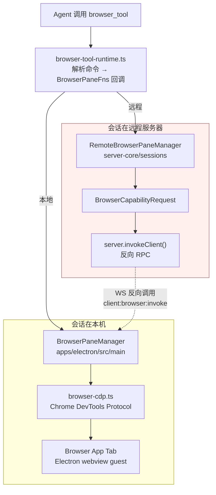

# 17 · 内置浏览器工具链

> 基于上游 craft-agents-oss v0.11.4 · 核验于 2026-08-09

Agent 可以驱动主 Shell 中的内置 Browser App Tab —— 打开网页、读无障碍树、点击填表、截图、看控制台与网络请求。这是「让 Agent 用你的登录态去操作任意网站」的能力底座，也是 Source 之外的第二条外部系统接入路径。

Browser 是 `kind: 'browser'` 的一等内置 App，支持多实例。每个 Tab 直接托管一个无特权 Electron `<webview>` guest；可信 toolbar 与 Agent 控制浮层由 Shell DOM 渲染。无 Shell 的测试/兼容路径仍可回退到旧 `BrowserWindow + BrowserView` host。

> **本篇讲代码结构。** 「怎么用这个功能」「API 发现的实操套路」见官方文档 <https://agents.craft.do/docs/browser/overview>（含 overview、API Discovery、Examples 三篇）。

## 为什么值得单独一章

它有两个别处没有的特性，直接影响二次开发时的判断：

1. **这是全仓库唯一大规模使用「反向 RPC」的功能** —— 浏览器窗口物理上只能在桌面客户端上，会话却可能跑在远程服务器。所以服务端要反过来调用客户端。
2. **它是 `executionMode: 'backend'` 工具的活样板** —— 想理解为什么这类工具代价高，读这一章最快。

## 代码分布

| 文件 | 行数 | 职责 |
|---|---|---|
| `apps/electron/src/main/browser-pane-manager.ts` | — | `BrowserPaneManager` —— 浏览器控制器；运行时挂接 Browser App Tab，兼容旧窗口 host |
| `apps/electron/src/main/browser-tab-host.ts` | — | Browser manager 与 Shell Tab 之间的 host/backend 契约 |
| `apps/electron/src/main/shell-view-manager.ts` | — | Browser App Tab 生命周期、guest 授权、attach/detach |
| `apps/electron/src/renderer/shell-main.tsx` | — | Browser toolbar、网页 guest、Agent 控制浮层 |
| `packages/shared/src/agent/browser-tool-runtime.ts` | 1730 | `browser_tool` 的命令解析与执行 |
| `apps/electron/src/main/browser-cdp.ts` | 1061 | Chrome DevTools Protocol 封装 |
| `packages/server-core/src/sessions/RemoteBrowserPaneManager.ts` | 344 | 远程会话用的代理实现 |
| `packages/shared/src/agent/browser-tools.ts` | 281 | 工具定义与 `BrowserPaneFns` 回调接口 |
| `packages/shared/src/agent/browser-tool-names.ts` | 80 | 工具名归一（含历史别名） |
| `packages/server-core/src/domain/browser-tool-detection.ts` | 43 | 判断是否要激活浏览器浮层 |
| `packages/server-core/src/transport/browser-capability.ts` | — | 反向 RPC 的线协议 |
| `apps/electron/src/main/handlers/browser.ts` | — | GUI 侧 RPC handler |
| `apps/electron/src/renderer/components/browser/` | — | 浏览器 UI（标签栏、工具条、空状态） |

## 架构：本地与远程两条路



### 反向 RPC 是这里的关键设计

普通 RPC 是客户端调服务端。浏览器这里反过来：**服务端调客户端**。

原因很直接 —— 真正的 Browser App Tab 带着用户的登录态，只能在用户那台机器上。会话逻辑可能跑在远程服务器，但它没有浏览器 guest。

实现：

- `RemoteBrowserPaneManager` 实现和本地一样的 `IBrowserPaneManager` 接口，是个薄代理
- 每个方法把参数打包成 `BrowserCapabilityRequest`，经 `server.invokeClient(clientId, 'client:browser:invoke', ...)` 发给桌面客户端
- 桌面客户端侧的 dispatcher 在真正的 `BrowserPaneManager` 上执行，结果原路返回
- `BrowserCapabilityMethod` 的名字与 `IBrowserPaneManager` 的方法**一一对应**，`args` 按声明顺序positional 传递
- 协议版本常量 `BROWSER_CAPABILITY_VERSION = 1`
- 每个 `(sessionId, workspaceId)` 一个实例，存在 `SessionManager` 的 `Map<sessionId, RemoteBrowserPaneManager>` 里，会话销毁时拆除

服务端要先确认客户端具备这个能力 —— 通过握手时上报的 `clientCapabilities`，用 `RpcServer.hasClientCapability()` / `findClientsWithCapability()` 查（见 [06-rpc](06-rpc.md)）。找不到有能力的客户端时抛 `BROWSER_NO_CAPABLE_CLIENT`。

相关的专用错误码（`protocol/types.ts`）：

```
BROWSER_NO_CAPABLE_CLIENT
BROWSER_INSTANCE_NOT_OWNED
BROWSER_REMOTE_UPLOAD_NOT_SUPPORTED
BROWSER_REMOTE_EVALUATE_BLOCKED
```

后两个说明**远程模式下文件上传与 `evaluate` 是被禁的** —— 前者拿不到客户端本地文件，后者是安全考虑。

> ⚠️ 代码注释多处引用 `docs/adr-transport-locality.md` 说明「本地性边界」的定义，但**这个文件没有随上游开源导出，仓库里不存在**。相关判断只能从代码反推。

## `browser_tool`：一个工具，CLI 风格的命令

对模型暴露的是**单个** `browser_tool`，参数里带一个类 CLI 的 `command` 字符串，而不是几十个独立工具。

实测支持的命令动词：

| 分类 | 命令 |
|---|---|
| 生命周期 | `open`、`close`、`release`、`hide`、`focus`、`windows` |
| 导航 | `navigate`、`back`、`forward` |
| 读取 | `snapshot`（无障碍树）、`screenshot`、`screenshot-region`、`console`、`network`、`downloads`、`find` |
| 交互 | `click`、`click-at`、`fill`、`type`、`select`、`scroll`、`drag`、`key`、`upload` |
| 剪贴板 | `get-clipboard`、`set-clipboard`、`paste` |
| 其它 | `wait`、`evaluate`、`window-resize`、`help` / `--help` / `-h` |

### 为什么是一个工具而不是二十个

历史上确实是拆开的。`browser-tool-names.ts` 里还留着 19 个旧别名（`browser_open`、`browser_click`、`browser_snapshot`……），用于兼容老会话、测试与日志：

```ts
export const LEGACY_BROWSER_TOOL_ALIASES = new Set([
  'browser_open', 'browser_navigate', 'browser_snapshot', 'browser_click', ...
])
```

工具名归一有两个函数，**用途不同别搞混**：

| 函数 | 接受 | 用在哪 |
|---|---|---|
| `normalizeCanonicalBrowserToolName()` | 只认 `browser_tool`（可带 `mcp__session__` 等命名空间前缀） | 运行时判定 |
| `normalizeBrowserToolName()` | 规范名 **+ 19 个历史别名** | 读老数据、日志 |

合成一个工具的收益是**省 token** —— 二十个工具定义要一直挂在上下文里，一个不用。代价是命令字符串要自己解析。

## 浮层激活规则

Agent 操作浏览器时，界面上会浮出浏览器面板让用户看到发生了什么。但不是所有命令都该触发。

`browser-tool-detection.ts` 的 `shouldActivateBrowserOverlay()`：

```ts
const BROWSER_TOOL_OVERLAY_EXCLUDED_COMMANDS = new Set([
  '--help', '-h', 'help',   // 只是查帮助
  'open', 'release', 'close', 'hide',   // 生命周期管理，本身不是「在操作页面」
])
```

也就是**除了这 7 个动词，其余都激活浮层**。加新命令时想一下它属于哪类。

## 会话与 Browser App Tab 的映射

工具命令里**不需要传实例 ID** —— 映射由回调提供方处理，走 `getOrCreateForSession` 模式。`browser-tools.ts` 的注释写得很明确。

这意味着：一个会话对应它自己的浏览器实例/Tab，Agent 不需要管理句柄。相关方法在 `BrowserCapabilityMethod` 里：`createForSession`、`getOrCreateForSession`、`focusBoundForSession`、`destroyForSession`、`bindSession`、`unbindAllForSession`。

生命周期命令保持兼容：`focus` 激活 Tab，`hide` 切离 Tab 但保留 guest，`close` 关闭 Tab 并销毁 guest，`window-resize` 设置 Browser surface viewport。

页面里的 `window.open` / `target="_blank"` 不创建独立原生窗口：前台 disposition 创建并激活同级 Browser App Tab，同时把 session/Agent 控制权转移到新 Tab；background disposition 创建后台 Tab。

### Agent 控制权

有一组 `setAgentControl` / `clearAgentControl` / `clearAgentControlForInstance` / `clearVisualsForSession` 方法 —— 用来标记「现在是 Agent 在开车」，并在结束时把控制权还给用户。

工具的结果文本里会附一句提示，引导模型用完就释放：

> When you are done using the browser, call browser_tool with command "close" to close the window entirely, or "release" to dismiss the overlay and let the user continue browsing.

`close` 是关掉窗口，`release` 是收起浮层但让用户继续用 —— **两者语义不同**。

## RPC 信道

`browserPane` 域有 20 个信道（`protocol/channels.ts`），全部是 **LOCAL_ONLY**：

```
create / destroy / list / navigate / go-back / go-forward / reload / stop /
focus / snapshot / click / fill / select / screenshot / evaluate / scroll
+ browser-empty-state:launch
+ 事件推送：state-changed / removed / interacted
```

它们在 `CHANNEL_MAP` 里是**嵌套命名空间**形式（`'browserPane.create'` → `api.browserPane.create()`，见 [06-rpc](06-rpc.md) 的映射一节）。

handler 在 `apps/electron/src/main/handlers/browser.ts` —— 这是**少数几个正当放在 electron 而非 server-core 的 handler 之一**，因为它真的需要 Electron `WebContents`、CDP 与本地 Shell Tab。

## 二次开发时的落点

| 想做什么 | 改哪里 |
|---|---|
| 加一个浏览器命令 | `browser-tool-runtime.ts` 加动词 + `BrowserPaneFns` 加回调 + `BrowserPaneManager` 实现 + 远程走 `BrowserCapabilityMethod` 加一项 |
| 改浮层激活规则 | `browser-tool-detection.ts` 的排除集合 |
| 改浏览器 UI | `apps/electron/src/renderer/shell-main.tsx`、`shell.css` |
| 让新命令支持远程会话 | **必须**同时加进 `BrowserCapabilityMethod` 并在客户端 dispatcher 实现，否则远程会话下该命令失效 |
| 接一个外部浏览器（非内嵌） | 大改；当前 CDP 绑定 Browser App guest `WebContents` |

> ⚠️ **加命令时最容易漏的一步**：只改了本地路径，没加 `BrowserCapabilityMethod`。本机测一切正常，远程 workspace 下该命令直接不可用。

## 排查清单

| 症状 | 看哪里 |
|---|---|
| 远程会话下浏览器命令报 `BROWSER_NO_CAPABLE_CLIENT` | 没有连着的客户端上报了浏览器能力；检查握手时的 `clientCapabilities` |
| 远程会话下 `upload` / `evaluate` 报错 | 设计如此：`BROWSER_REMOTE_UPLOAD_NOT_SUPPORTED` / `BROWSER_REMOTE_EVALUATE_BLOCKED` |
| 新加的命令本机好用、远程失效 | 漏了 `BrowserCapabilityMethod` 与客户端 dispatcher |
| 浮层该出没出 / 不该出却出了 | `BROWSER_TOOL_OVERLAY_EXCLUDED_COMMANDS` |
| 老会话里的 `browser_click` 之类识别不了 | 用了 `normalizeCanonicalBrowserToolName`（不认别名），应该用 `normalizeBrowserToolName` |
| 用完浏览器用户操作不了 | Agent 没调 `release` / `close`；或 `clearAgentControl` 没走到 |
| `BROWSER_INSTANCE_NOT_OWNED` | 跨会话操作了不属于自己的实例 |
